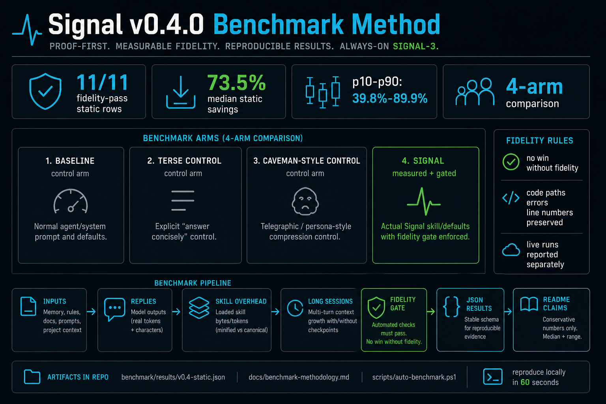
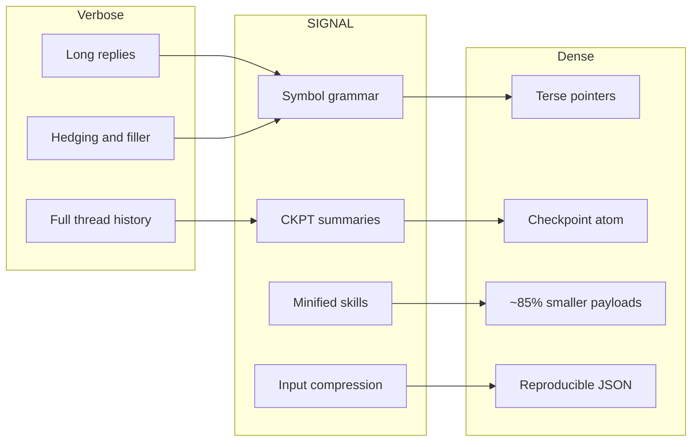
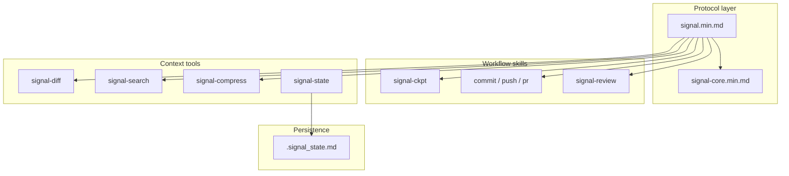
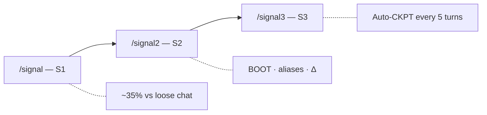

<p align="center">
  
</p>

<h1 align="center">SIGNAL · v0.4.0</h1>

<p align="center"><strong>Compression you can prove. Dense mode agents can live in.</strong><br />
Professional token compression for agents: always-on SIGNAL-3, input compression, minified skill payloads, structured terse replies, and checkpointed long sessions.</p>

<p align="center">
  <a href="https://github.com/mattbaconz/signal/stargazers"></a>
  <a href="LICENSE"></a>
  <a href="https://github.com/mattbaconz/signal/actions"></a>
  
</p>

### At a glance

| Topic | Summary |
| --- | --- |
| **What you get** | Shorter **instructions + replies** in the agent; **checkpoints** (S3) instead of pasting full thread history when you want them. |
| **What you run** | `npx skills add mattbaconz/signal` → **`/signal3`** (recommended) · **`/signal2`** (strong) · **`/signal`** (light). |
| **What this tree is** | **`skills/`** = source specs you edit. **`gemini-signal/`** · **`claude-signal/`** · **`kiro-signal/`** = mirrored host packages (don’t hand-edit; see [CONTRIBUTING](CONTRIBUTING.md)). |

Protocol entrypoints: [`skills/signal.min.md`](skills/signal.min.md) · symbols [`skills/signal-core.min.md`](skills/signal-core.min.md) · repo [github.com/mattbaconz/signal](https://github.com/mattbaconz/signal) · releases [CHANGELOG.md](CHANGELOG.md)

## 60-second start

```bash
npx skills add mattbaconz/signal
```

Then activate the default dense workflow:

```text
/signal3
```

To make that default automatic for every prompt, install the always-on host rules:

```powershell
powershell -NoProfile -ExecutionPolicy Bypass -File .\scripts\install-signal-all.ps1 -AlwaysOn -DryRun
powershell -NoProfile -ExecutionPolicy Bypass -File .\scripts\install-signal-all.ps1 -AlwaysOn
```

Use `/signal-compress` when your loaded memory/rules/docs are getting too large. Verify the proof suite locally:

```powershell
powershell -NoProfile -ExecutionPolicy Bypass -File .\scripts\auto-benchmark.ps1
```

**Expected proof-first numbers:** static v0.4 fixtures show **11/11 fidelity-pass rows**, **73.5% median estimated savings**, and **39.8%–89.9% p10–p90 savings** across input-compression and skill-overhead checks. Live output claims are reported separately and must pass fidelity gates before they count.

### Who it is for

Use Signal when you run long coding-agent sessions, keep large `AGENTS.md` / `CLAUDE.md` / `GEMINI.md` files, or need terse replies without turning the assistant into a joke persona. The practical promise is simple: **less repeated context, fewer filler tokens, same protected technical details.**

<p align="center">
  <a href="#demo">Demo</a> ·
  <a href="#install">Install</a> ·
  <a href="#commands">Commands</a> ·
  <a href="#signal-vs-caveman-style">Signal vs Caveman-style</a> ·
  <a href="#benchmark">Benchmark</a> ·
  <a href="#repo-map">Repo map</a> ·
  <a href="#architecture">Architecture</a> ·
  <a href="#changelog">Changelog</a>
</p>

<p align="center"><a href="#before--after">Before / after</a> · <a href="#tiers">Tiers</a> · <a href="#coding-norms-karpathy-style">Karpathy norms</a> · <a href="#git-workflows--ci">Git &amp; CI</a> · <a href="#star-history">Stars</a></p>

---

## Demo



**What to trust first:** the v0.4 proof suite separates static input/skill shrinkage from live output-token claims. Static proof currently has **11/11 fidelity-pass rows**, **73.5% median estimated savings**, and **39.8%–89.9% p10–p90 savings** across input-compression and skill-overhead fixtures. Live wins count only when the fidelity gate passes. Details: [Benchmark](#benchmark) · [docs/benchmark-methodology.md](docs/benchmark-methodology.md) · [docs/token-metrics.md](docs/token-metrics.md).

**What’s illustration:** scenarios A–C use `ceil(characters / 4)` (not billed API tokens) — good for shape, not primary “proof” vs hosts that report real tokenizer counts.

**Reproduce:** [benchmark/run.ps1](benchmark/run.ps1) (proof suite, live dry-runs, and long-session runners) · methodology [docs/benchmark-methodology.md](docs/benchmark-methodology.md).

---

## Before / after


| 👤 **Verbose agent**                                        | 🌐 **SIGNAL**                                                                                                                     |
| ----------------------------------------------------------- | --------------------------------------------------------------------------------------------------------------------------------- |
| “I think the problem might be in `auth.js` around line 47…” | `auth.js:47` · null ref · guard — **~7× fewer tokens** in the scripted benchmark.                                                 |
| Paste 10 turns of chat + tool noise into context.           | **CKPT atom**: stack, progress, next step — transcript stays out of the window.                                                   |
| One giant `SKILL.md` tree + references forever.             | **Canonical `.md`** for humans, **`.min.md`** for the agent — **~85%** smaller across the eight main skill pairs ([Benchmark](#benchmark)). |


---

## Install

```bash
npx skills add mattbaconz/signal
```

Global:

```bash
npx skills add mattbaconz/signal -y -g
```

**After install:** open [`skills/signal.min.md`](skills/signal.min.md), pick **S1 / S2 / S3**, add workflow skills (`signal-commit`, …) only when you need them.

### Compatibility matrix

| Host | Best path | Auto-activation |
| --- | --- | --- |
| Claude Code | Plugin marketplace or standalone `~/.claude/skills/` copy | Plugin/hooks can remind; slash command still explicit |
| OpenAI Codex | `npx skills add mattbaconz/signal` or copy into `.codex/skills` | `AGENTS.md` can make S3 always-on |
| Gemini CLI | Gemini extension package or repo-root `GEMINI.md` | `GEMINI.md` can make S3 always-on |
| Cursor | Copy skills/rules into Cursor skill/rule paths | `.cursor/rules/signal.mdc` can make S3 always-on |
| Windsurf | Generated `.windsurf/rules/signal.md` | Rules can apply automatically |
| Cline | Generated `.clinerules/signal.md` | Rules can apply automatically |
| GitHub Copilot | Generated `.github/copilot-instructions.md` | Instruction file applies in repo context |
| Kiro | Import from `kiro-signal/skills/<name>` subtree | Per-skill import; activation depends on Kiro workspace |

### Claude Code (app + CLI)

**Plugins only exist in [Claude Code](https://code.claude.com/docs/en/overview)** (the coding agent). The consumer **claude.ai** desktop chat does **not** expose **`/plugin`** — if slash commands like **`/plugin`** are ignored or “unknown,” you’re either in the wrong app or on an old Claude Code build. [Update Claude Code](https://code.claude.com/docs/en/setup) and restart; official troubleshooting: [Discover plugins — “/plugin command not recognized”](https://code.claude.com/docs/en/discover-plugins).

**A) Plugin marketplace (when `/plugin` works)** — in the **Claude Code** session, same input as other slash commands:

```text
/plugin marketplace add mattbaconz/signal
/plugin install signal@signal-suite
```

(`owner/repo` works for GitHub; you can use a full Git URL instead.) Then run **`/reload-plugins`**. Marketplace id is **`signal-suite`** — confirm with **`/plugin marketplace list`**. Details: [`claude-signal/README.md`](claude-signal/README.md).

With the plugin, skills are namespaced: **`/signal:signal`**, **`/signal:signal-commit`**, **`/signal:signal-push`**, … (plugin name **`signal`**, then **`:`**, then folder name under [`claude-signal/skills/`](claude-signal/skills/)).

**B) No `/plugin` — standalone skills (works everywhere Claude loads `~/.claude/skills/`):** clone this repo, run **`scripts/sync-integration-packages.ps1`** once if needed, then:

```powershell
powershell -NoProfile -ExecutionPolicy Bypass -File .\scripts\install-signal-all.ps1
```

That copies [`claude-signal/skills/`](claude-signal/skills/) into **`%USERPROFILE%\.claude\skills\`**. Then use short commands like **`/signal`**, **`/signal-commit`** (see [Commands](#commands)). **Do not** also install the plugin for the same skills.

**C) One-off:** run Claude Code from a terminal with the plugin dir — [`claude-signal/README.md`](claude-signal/README.md) (`claude --plugin-dir ./claude-signal` from the repo).

**Optional:** merge [`templates/claude-CLAUDE.min.md`](templates/claude-CLAUDE.min.md) into your project **`CLAUDE.md`** for thin always-on defaults.

### Always-on SIGNAL-3

Users should not need to type `/signal3` on every prompt. Add the host instruction file once, then prompt normally. The agent treats `signal3`, `SIGNAL-3`, and `/signal3` as the same reset command.

```powershell
powershell -NoProfile -ExecutionPolicy Bypass -File .\scripts\install-signal-all.ps1 -AlwaysOn -DryRun
powershell -NoProfile -ExecutionPolicy Bypass -File .\scripts\install-signal-all.ps1 -AlwaysOn
```

Details and host file map: [`docs/always-on.md`](docs/always-on.md).

---

## Commands


| Command          | What it does                       |
| ---------------- | ---------------------------------- |
| `/signal`        | S1 — entry tier                    |
| `/signal2`       | S2 — strong default                |
| `/signal3`       | S3 — auto-CKPT                     |
| `/signal-commit` | Stage + conventional commit        |
| `/signal-push`   | Commit + push                      |
| `/signal-pr`     | Push + PR (`gh`)                   |
| `/signal-review` | One-line review, severity required |
| `/signal-state`  | `.signal_state.md`                 |
| `/signal-compress` | Compress memory/rules/docs with fidelity gates |
| `/signal-diff`   | Summarized changes                 |
| `/signal-search` | Summarized search                  |


Tier detail: [Tiers](#tiers).

---

## Repo map

There is **no** legacy top-level `signal/` directory in this repo—ignore older docs that referred to it. This table is what you actually open after cloning.


| Location                                                               | What it is                                                                   | You need it if…                                                       |
| ---------------------------------------------------------------------- | ---------------------------------------------------------------------------- | --------------------------------------------------------------------- |
| `[skills/](skills/)`                                                   | **Canonical** skill specs: `*.md` (readable) + `*.min.md` (dense)            | You install via `npx skills add` or copy skills into an agent         |
| `[gemini-signal/](gemini-signal/)`, `[claude-signal/](claude-signal/)` | **Mirrored** host extension layouts (`SKILL.md` per tool)                    | You ship the Gemini CLI or Claude Code plugin from this tree          |
| `[kiro-signal/](kiro-signal/)`                                         | **Kiro** mirror: `skills/` + bundled `references/` with rewritten paths      | You import into Kiro IDE — see [docs/kiro.md](docs/kiro.md)           |
| `[references/](references/)`                                           | Shared refs (symbols, Karpathy norms, benchmarks, checkpoint notes)          | You cite norms or symbols                                             |
| `[templates/](templates/)`                                             | Snippets to merge into a **project’s** GEMINI / CLAUDE files                 | You integrate SIGNAL into an app repo                                 |
| `[scripts/](scripts/)`, `[benchmark/](benchmark/)`                     | `shrink.ps1`, `sync-integration-packages.ps1`, `verify.ps1`, proof benchmark runners | You contribute or verify locally ([CONTRIBUTING.md](CONTRIBUTING.md)) |


---

## Why SIGNAL

SIGNAL is not just “be brief.” It is a protocol surface for agents that need dense output, compressed input, durable state, and reproducible evidence. The core bet is that professional compression needs gates and artifacts, not only a terse personality.



**Cumulative** transcript savings (baseline vs checkpoint-style history) are covered in [benchmark/README.md](benchmark/README.md) (`benchmark/long-session/` after a full clone). **Prompt vs output vs `tokens.total`** — hosts report different scopes; see [docs/token-metrics.md](docs/token-metrics.md).

---

## Signal vs Caveman-style

[Caveman](https://github.com/JuliusBrussee/caveman) is the right comparison point because it made terse agent output easy to install and popular. Its public README currently reports a one-line `npx skills add JuliusBrussee/caveman` install, average output savings around **65%** across Claude API benchmark prompts, and `caveman-compress` input savings around **46%** on memory files. The [Caveman release notes](https://github.com/JuliusBrussee/caveman/releases) also emphasize a reproducible benchmark system and one-command install.

SIGNAL v0.4.0 competes on a different axis: professional dense mode with proof gates.

| Capability | Caveman-style baseline | SIGNAL v0.4.0 |
| --- | --- | --- |
| Output style | Persona/telegraphic compression | Professional dense protocol: terse, no preamble, confidence tokens, templates |
| Input compression | Memory-file compression | `signal-compress` for memory, prompts, rules, and docs with protected-token checks |
| Benchmark controls | Strong terse-control idea | Four arms: `baseline`, `terse-control`, `caveman-style`, `signal` |
| What counts as a win | Reported savings plus validation | No win unless fidelity passes: code, paths, line numbers, errors, versions, and terms preserved |
| Long sessions | Output/input savings | Checkpoint-oriented methodology for cumulative context growth |
| Install posture | One-command install | One-command install plus always-on SIGNAL-3 host rules |

The fair claim is not “SIGNAL always emits fewer output tokens than Caveman.” Caveman is very strong at raw output compression. The stronger SIGNAL claim is: **Signal is easier to trust in professional agent workflows because every benchmark claim must pass a fidelity gate and map back to reproducible JSON.**

---

## Tiers

Use `/signal`, `/signal2`, or `/signal3`.


| Tier   | You get                                  | Rough habit savings        |
| ------ | ---------------------------------------- | -------------------------- |
| **S1** | Symbols, no preamble, no hedge, terse    | ~35%                       |
| **S2** | S1 + BOOT, aliases, delta-friendly turns | another ~20% on top        |
| **S3** | S2 + **auto-checkpoint every 5 turns**   | long sessions stay bounded |


---

## Symbol grammar (snippet)


| Symbol | Meaning               | Example              |
| ------ | --------------------- | -------------------- |
| `→`    | causes / produces     | `nullref→crash`      |
| `∅`    | none / remove / empty | `cache=∅`            |
| `Δ`    | change / diff         | `Δ+cache→~5ms`       |
| `!`    | required / must       | `!fix before deploy` |
| `[n]`  | confidence 0.0–1.0    | `fix logic [0.95]`   |


Full reference: `[skills/signal-core.min.md](skills/signal-core.min.md)`.

---

## Benchmark

v0.4.0 uses a proof-first benchmark methodology. A compression win counts only when fidelity passes: protected code, paths, line numbers, versions, quoted errors, identifiers, and technical terms must remain intact. The generated diagram above is a visual summary; the source of truth is the checked-in JSON and runner.

Benchmark arms:

| Arm | Purpose |
| --- | --- |
| `baseline` | Normal agent/system prompt |
| `terse-control` | Explicit "answer concisely" control |
| `caveman-style` | Telegraphic/persona-style compression control |
| `signal` | Actual SIGNAL skill/defaults |

**Current static snapshot:** [`benchmark/results/v0.4-static.json`](benchmark/results/v0.4-static.json) reports **11/11 fidelity-pass rows**, **73.5% median estimated savings**, and **39.8%–89.9% p10–p90 savings** across input-compression fixtures and skill-overhead checks. Live output and long-session results are reported separately because provider token accounting varies by host.

Methodology: [`docs/benchmark-methodology.md`](docs/benchmark-methodology.md). Runner: [`benchmark/proof-suite.ps1`](benchmark/proof-suite.ps1).

### What the static proof covers

| Category | Rows | Current result | Source |
| --- | ---: | --- | --- |
| Input compression | 3 | `3/3` fidelity pass; median savings `39.8%` | [`benchmark/fixtures/input-compress.json`](benchmark/fixtures/input-compress.json) |
| Skill overhead | 8 | `8/8` fidelity pass; minified surfaces shrink the loaded skill payload | [`skills/`](skills/) |
| Combined static snapshot | 11 | `11/11` fidelity pass; median savings `73.5%`; p10–p90 `39.8%–89.9%` | [`benchmark/results/v0.4-static.json`](benchmark/results/v0.4-static.json) |

### Output compression

Output benchmarks are intentionally harder than the old “verbose vs terse” demo. They compare four arms:

- `baseline`
- `terse-control`
- `caveman-style`
- `signal`

The default live command runs a one-scenario smoke test and writes ignored local JSON under `benchmark/results/local/`. Full live output runs are opt-in because provider capacity, model version, and token accounting move over time.

```powershell
powershell -NoProfile -ExecutionPolicy Bypass -File .\scripts\auto-benchmark.ps1 -Live
```

Full live output run:

```powershell
powershell -NoProfile -ExecutionPolicy Bypass -File .\scripts\auto-benchmark.ps1 -Live -MaxLiveScenarios 0
```

Do not promote a live output table into the README unless every claimed winning row has `success=true` and a fidelity score.

### Skill pairs (canonical `.md` → `.min.md`) — primary on-disk proof


| Pair              | Bytes (≈)          | Est. tok (≈)      | Shrink   |
| ----------------- | ------------------ | ----------------- | -------- |
| signal            | 3.3K → 0.9K        | ~819 → ~217       | ~74%     |
| signal-ckpt       | 5.6K → 0.7K        | ~1389 → ~163      | ~88%     |
| signal-commit     | 8.3K → 0.7K        | ~2071 → ~178      | ~91%     |
| signal-compress   | 2.9K → 0.9K        | ~717 → ~221       | ~69%     |
| signal-pr         | 4.7K → 0.5K        | ~1177 → ~130      | ~89%     |
| signal-push       | 3.7K → 0.5K        | ~936 → ~131       | ~86%     |
| signal-review     | 5.5K → 0.6K        | ~1378 → ~145      | ~90%     |
| signal-state      | 2.0K → 0.7K        | ~511 → ~163       | ~68%     |
| **8 pairs total** | **~36.0K → ~5.3K** | **~8996 → ~1329** | **~85%** |


Min-only helpers (`signal-core`, `signal-diff`, `signal-search`) ≈ **1.6K** bytes (~**389** est. tokens).

### Reading the numbers & multi-turn proof

`[docs/token-metrics.md](docs/token-metrics.md)` — prompt vs output vs `tokens.total`. **Multi-turn / cumulative** protocol benchmark: `[benchmark/long-session/](benchmark/long-session/)` (see `[benchmark/README.md](benchmark/README.md)`) — that is where checkpoint-style savings **compound** vs a growing baseline transcript.

### Reproduce

**Static** (heuristic + skill table printout; no API):

```powershell
powershell -NoProfile -ExecutionPolicy Bypass -File .\scripts\auto-benchmark.ps1
```

**Long-session** (multi-turn; many API calls):

```powershell
powershell -NoProfile -ExecutionPolicy Bypass -File .\benchmark\run.ps1 -Mode LongSession -Quick
```

---

## Architecture



**Tier ladder:**



---

## Coding norms (Karpathy-style)

**Tiers** shape **assistant chat** (symbols, templates, checkpoints). **Karpathy-style norms** shape **implementation work** (how you edit code and ship commits): orthogonal axes—activating `/signal3` does not replace surgical diffs or explicit assumptions.

Norms in brief (canonical list: `[references/karpathy-coding-norms.md](references/karpathy-coding-norms.md)`):

1. **Assumptions** — explicit over implicit; say when unsure.
2. **Simplicity** — avoid over-engineering.
3. **Surgical diffs** — minimal changes tied to the goal.
4. **Verifiable goals** — reproduce, test, or verify where it matters.
5. **No filler** — skip “here is the code”; show the code.


| Resource       | Link                                                                                                                                                                                                |
| -------------- | --------------------------------------------------------------------------------------------------------------------------------------------------------------------------------------------------- |
| Full norms     | `[references/karpathy-coding-norms.md](references/karpathy-coding-norms.md)`                                                                                                                        |
| In skills      | `[skills/signal.md](skills/signal.md)`, `[skills/signal-core.min.md](skills/signal-core.min.md)` (`KarpathyNorms`), `[skills/signal-commit.min.md](skills/signal-commit.min.md)` (`followKarpathy`) |
| Host templates | `[templates/gemini-GEMINI.md](templates/gemini-GEMINI.md)`, `[templates/claude-CLAUDE.md](templates/claude-CLAUDE.md)`                                                                              |


---

## Git workflows & CI


| Skill                                                        | Role                                                   |
| ------------------------------------------------------------ | ------------------------------------------------------ |
| `[skills/signal-commit.min.md](skills/signal-commit.min.md)` | Stage all, conventional commit (`--draft` / `--split`) |
| `[skills/signal-push.min.md](skills/signal-push.min.md)`     | Commit + push                                          |
| `[skills/signal-pr.min.md](skills/signal-pr.min.md)`         | Commit + push + `gh pr create`                         |


**CI:** `[.github/workflows/verify.yml](.github/workflows/verify.yml)` runs `[scripts/verify.ps1](scripts/verify.ps1)` on Windows for `main` and PRs.

---

## Changelog

All releases: [CHANGELOG.md](CHANGELOG.md).

---

## Repository layout (clone root)

```
./
├── skills/              # canonical *.md + *.min.md (edit here; see CONTRIBUTING.md)
├── assets/              # logos, benchmark infographic
├── references/          # symbols, Karpathy norms, benchmarks, checkpoint notes
├── templates/           # Gemini / Claude merge snippets
├── scripts/             # shrink.ps1, verify.ps1, sync-integration-packages.ps1
├── benchmark/           # proof-suite.ps1, fixtures, live benchmark runners
├── gemini-signal/       # Gemini CLI extension (mirrored from skills/)
├── claude-signal/       # Claude Code plugin (mirrored from skills/)
├── kiro-signal/         # Kiro IDE import (mirrored + bundled references/)
├── hooks/
└── GEMINI.md            # root context (synced from gemini-signal/)
```

---

## Star History

<a href="https://www.star-history.com/?repos=mattbaconz%2Fsignal&type=date&legend=top-left">
 <picture>
   <source media="(prefers-color-scheme: dark)" srcset="https://api.star-history.com/chart?repos=mattbaconz/signal&type=date&theme=dark&legend=top-left" />
   <source media="(prefers-color-scheme: light)" srcset="https://api.star-history.com/chart?repos=mattbaconz/signal&type=date&legend=top-left" />
   
 </picture>
</a>

---

*v0.4.0 — Proof-first compression. Professional dense mode.*
