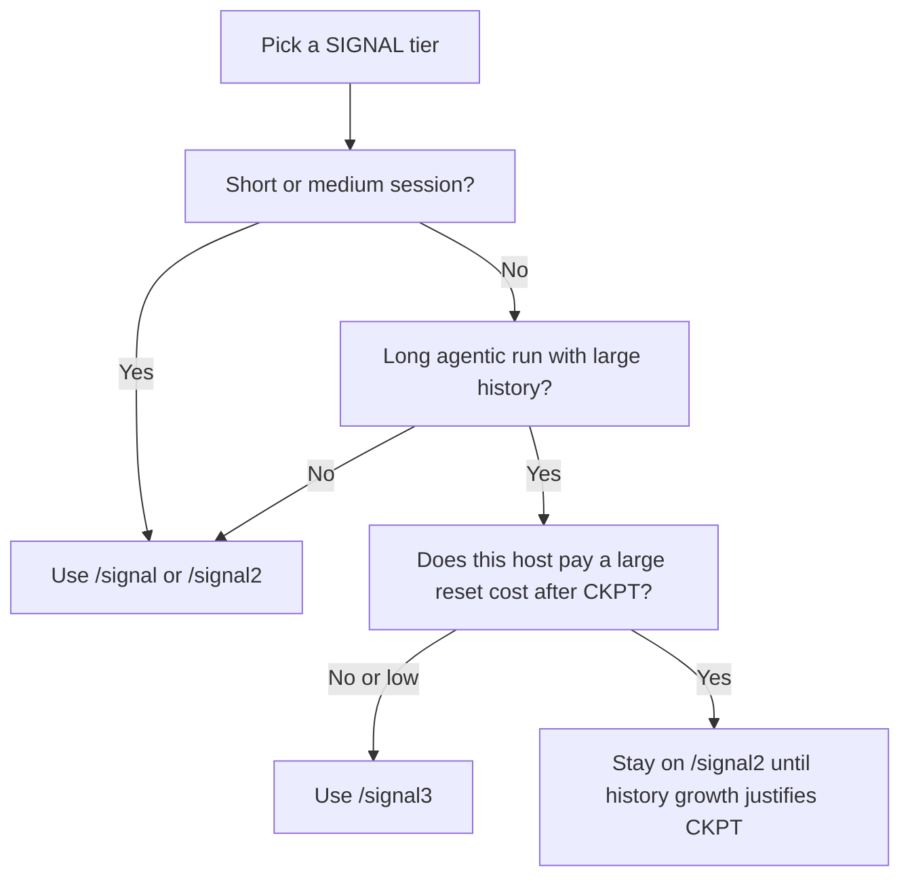

<p align="center">
  
</p>

# SIGNAL — Agent Skills bundle

| | |
|---|---|
| **Version** | **0.1.0** (`signal_bundle_version` in each core `SKILL.md`) |
| **Format** | [Agent Skills](https://agentskills.io/) — one folder per skill, `SKILL.md` + optional `references/` and `scripts/` |
| **Normative behavior** | Defined **inside each skill’s `SKILL.md`** (especially [`signal/SKILL.md`](signal/SKILL.md)). This README is the **human-facing specification summary** and onboarding path. |
| **License** | [MIT](LICENSE) — permissive; safe for commercial tools and forks. |

---

## Why this README exists

**If you are a developer:** SIGNAL is not a library you import — it is a **protocol your agent follows** once the skills are installed. You need a clear picture of *what each skill does*, *which command to use when*, and *where the real rules live* (the skill files). This document is written to answer those questions in one pass.

**If you are evaluating adoption:** The value is **fewer tokens per turn**, **structured outputs that compose across turns**, and **optional checkpointing** for long sessions — with explicit tradeoffs (especially on hosts that charge a large “session boot” cost). The [before / after](#before--after) table and [benchmarks](#benchmarks-and-evidence) sections quantify the intent; [When to use which tier (canonical)](#when-to-use-which-tier-canonical) resolves tier choice per host.

---

## Table of contents

1. [Problem and approach](#problem-and-approach)
2. [Skill catalog — what ships in this repo](#skill-catalog--what-ships-in-this-repo)
3. [Invocation map — what to type and when](#invocation-map--what-to-type-and-when)
4. [Tier specification (SIGNAL-1 / 2 / 3)](#tier-specification-signal-1--2--3)
5. [When to use which tier (canonical)](#when-to-use-which-tier-canonical)
6. [Compression layers (summary)](#compression-layers-summary)
7. [Install](#install) (includes [maximize token savings](#maximize-token-savings))
8. [Cross-tool porting](#cross-tool-porting)
9. [Verify and safe first use](#verify-and-safe-first-use)
10. [Workflow skills (git) on Windows](#workflow-skills-git-on-windows)
11. [Benchmarks and evidence](#benchmarks-and-evidence)
12. [BOOT presets](#boot-presets)
13. [Optional extensions](#optional-extensions)
14. [Rules of the road](#rules-of-the-road)
15. [Releasing (maintainers)](#releasing-maintainers)
16. [Community evidence](#community-evidence)
17. [Repository layout](#repository-layout)
18. [Further reading](#further-reading)

---

## Problem and approach

**Problem:** In agentic coding, **unstructured natural language compounds**. Every turn re-introduces tone, hedging, and repeated context. That inflates tokens, dilutes signal for the next model step, and makes long sessions expensive.

**Approach:** SIGNAL constrains **how** the model answers (templates, symbols, confidence as numbers, optional checkpoints) without asking you to abandon precision. Code stays verbatim; technical terms stay unabbreviated; uncertainty becomes `[conf]` instead of a paragraph.

**Scope:** SIGNAL optimizes **assistant output shape and session state representation**. It does not replace your editor, linter, or VCS — the [`signal-commit`](#skill-catalog--what-ships-in-this-repo) family wraps normal git and [`gh`](https://cli.github.com/) behavior.

---

## Skill catalog — what ships in this repo

These six directories are the **core bundle** versioned together as **v0.1.0**:

| Skill folder | Role | Loads when |
|---|---|---|
| [`signal/`](signal/) | **Core protocol** — tiers, templates, BOOT, checkpoints, `SIGNAL_DRIFT` escape hatch | User asks for compression, `/signal`, `/signal2`, `/signal3`, or long sessions where tokens matter |
| [`signal-commit/`](signal-commit/) | Stage all + commit with **Conventional Commits** message from diff; **no prompts** by default | “Just commit”, `/signal-commit`, commit without a message |
| [`signal-push/`](signal-push/) | Same as commit, then **push** (sets upstream on new branches) | “Commit and push”, `/signal-push` |
| [`signal-pr/`](signal-pr/) | Same as push, then **open PR** via `gh` | `/signal-pr`, “open a PR” |
| [`signal-review/`](signal-review/) | Review in **one line per issue**, severity required, compressed template | `/signal-review`, “review this” |
| [`signal-ckpt/`](signal-ckpt/) | **Manual** checkpoint — collapse history to ≤50-token atom | `/signal-ckpt`, “checkpoint”; auto in SIGNAL-3 |

Additional material in this repository:

| Path | Purpose |
|---|---|
| [`signal-state/`](signal-state/) | Optional companion skill (install if you use it; not part of the “six core” version stamp) |
| [`templates/`](templates/) | Snippets to merge into project **`GEMINI.md`** / **`CLAUDE.md`** |

**Local-only (gitignored):** a `benchmark/` directory next to your clone can hold reproducibility scripts and run artifacts — it is **not** part of the public tree. Summary numbers are in [Benchmarks and evidence](#benchmarks-and-evidence) below.

---

## Invocation map — what to type and when

Use this as the **default routing** for day-to-day work:

| You want… | Start with | Notes |
|---|---|---|
| Shorter answers, symbol grammar, less filler | `/signal` | Lowest friction; no checkpointing |
| Same, plus BOOT lines, aliases, **delta-only** turns across a thread | `/signal2` | Strong default for multi-turn work without resets |
| Long agentic runs where **history size** dominates cost | `/signal3` | Read [When to use which tier (canonical)](#when-to-use-which-tier-canonical) first — some hosts pay a large per-reset “boot tax” |
| Commit without writing a message | `/signal-commit` | Uses `--draft` / `--dry` for review modes |
| Push after that | `/signal-push` | |
| Push + GitHub PR | `/signal-pr` | Requires `gh` CLI authenticated |
| Structured code review | `/signal-review` | |
| Force a state atom mid-session | `/signal-ckpt` | |

**Cross-reference:** portability across tools (paths, consent flags) is in [Cross-tool porting](#cross-tool-porting) below.

---

## Tier specification (SIGNAL-1 / 2 / 3)

Normative tier definitions live in [`signal/SKILL.md`](signal/SKILL.md). Summary:

| Tier | Trigger | Active capabilities (incremental) | Typical remaining output size* |
|---|---|---|---|
| **SIGNAL-1** | `/signal` | Symbol grammar, filler drop, no preamble | ~65% of unconstrained |
| **SIGNAL-2** | `/signal2` | + BOOT declarations, aliases, delta-only turns | ~80% savings vs verbose |
| **SIGNAL-3** | `/signal3` | All layers + **auto checkpoint every 5 turns** | ~90%+ on long sessions when checkpoints dominate |

\*Order-of-magnitude; actual savings depend on task and host. Do not treat percentages as guarantees — treat them as **design targets**.

**Choosing a tier:** use [When to use which tier (canonical)](#when-to-use-which-tier-canonical) below. Rule of thumb: default to **`/signal`** or **`/signal2`**; reserve **`/signal3`** for sessions where history growth justifies checkpointing.

---

## When to use which tier (canonical)

This section is the canonical answer to: **which SIGNAL tier should you use on this host, for this kind of session?**

The short version:

- Use **`/signal`** for everyday terse output.
- Use **`/signal2`** when you want stronger structure across a multi-turn session without checkpoint resets.
- Use **`/signal3`** only when the conversation history is large enough that checkpoint replacement is worth the host's reset cost.

### Default recommendation

For most real work, start with **`/signal`** or **`/signal2`**.

- **`/signal`** is the safest default for short tasks, single questions, and lightweight coding help.
- **`/signal2`** is the best default for longer back-and-forth work when you want BOOT defaults, aliases, and delta-only turns without introducing checkpoint behavior.
- **`/signal3`** is the specialist tier for deep, long-running agentic sessions where conversation history becomes the dominant cost.

If you are not sure, pick **`/signal2`** first.

### Why `/signal3` is not the default

`/signal3` adds checkpoint compression, which is SIGNAL's biggest lever on long sessions. The catch is that some hosts charge a large hidden cost when a checkpoint causes a fresh session.

If the host must replay its full system prompt, tool definitions, and workspace index on every new session, that reset can cost **~60k–80k tokens** before your actual work even resumes.

That means:

- If your history is still small, `/signal3` can be a net loss.
- If your history is large and keeps growing, `/signal3` can become the best option.

This is why SIGNAL should be chosen **per host** and **per session shape**, not as a one-size-fits-all default.



### Host guidance

| Host shape | Recommended default | Why |
|---|---|---|
| IDE-embedded agent with one continuous conversation | **`/signal`** or **`/signal2`**, then consider **`/signal3`** for very long sessions | You usually get the benefit of terse output and structured turns immediately. Checkpoint behavior may be less punitive if the host does not fully reboot the agent context. |
| CLI agent that starts a fresh session after checkpoint boundaries | **`/signal`** or **`/signal2`** by default | A fresh session can replay a large framework payload, so `/signal3` only pays off after history gets very large. |
| Short debugging, review, or Q&A session | **`/signal`** | Lowest friction, immediate per-turn savings. |
| Multi-turn implementation or refactor session without huge context buildup yet | **`/signal2`** | Better structure and delta-only turns without checkpoint reset risk. |
| Deep agentic workflow with large accumulated history and repeated checkpoints | **`/signal3`** | Best chance to win once history replacement dominates host reset cost. |

For installation paths and host-specific discovery details, see [Cross-tool porting](#cross-tool-porting) below.

### Practical decision rule

1. Start with **`/signal`** or **`/signal2`**.
2. Watch the session shape, not just the turn count.
3. Escalate to **`/signal3`** only when conversation history is clearly becoming the expensive part of the session.

Do not treat "5+ turns" by itself as the trigger. Five tiny turns are still tiny history.

### Evidence (what we measure)

The benchmark story is split in two — both matter when choosing a tier:

- **Checkpoint atom vs. verbatim history** — a canned multi-turn slice can shrink to a single `CKPT`-style atom on the order of **~94%** fewer tokens than verbatim history (~18× compression in one representative run; token estimates use a 4 chars/token heuristic).
- **Full host runs (e.g. Gemini CLI)** — some hosts replay a large framework payload on every fresh session, so **CLI boot tax** can dominate short runs; SIGNAL’s per-turn and checkpoint savings show up clearly only once conversational history is large enough to matter.

Reproducibility scripts and raw JSON live under a **local** `benchmark/` folder if you maintain them beside the clone (`benchmark/` is gitignored and not published).

---

## Compression layers (summary)

Full grammar and examples: [`signal/references/symbols.md`](signal/references/symbols.md), [`signal/references/checkpoint.md`](signal/references/checkpoint.md), [`signal/references/boot-presets.md`](signal/references/boot-presets.md).

| Layer | What it reduces |
|---|---|
| **Output templates** | Prose → typed one-line atoms (`TMPL:bug`, `TMPL:arch`, …) |
| **Checkpoint (`CKPT`)** | Full thread → ≤50-token state atom (when tier + host allow) |
| **BOOT declaration** | Re-deciding format/tone every turn |
| **Aliases** | Repeated long phrases → short stable keys |
| **Delta-only turns** | Re-sending unchanged context |
| **`[conf]`** | Hedging vocabulary → single confidence token |

If the model cannot satisfy the active template, the spec’d escape is a single line: `SIGNAL_DRIFT: <reason>` (see core skill).

---

## Install

**Universal (skills ecosystem):**

The Skills CLI expects a **GitHub source** as `owner/repo` (not a bare name). After cloning, it discovers every top-level skill folder that contains `SKILL.md`.

```bash
npx skills add mattbaconz/signal
```

Non-interactive install (all skills, user-level paths): add `-y` and `-g` per the CLI (`npx skills add --help`).

**Gemini CLI (from a checkout of this repo):**

```bash
gemini skills install /path/to/your/clone/signal --consent
```

**Manual copy** into your tool’s skills directory, for example:

| Tool / convention | Typical location |
|---|---|
| Claude Code | `~/.claude/skills/` |
| Gemini CLI | `~/.gemini/skills/` |
| Cursor | `~/.cursor/skills/` |
| OpenAI Codex | `~/.codex/skills/` |
| Universal agents dir | `~/.agents/skills/` |

Authoritative product list: [agentskills.io/home](https://agentskills.io/home).

**Windows — install all six core skills into standard folders at once:**

```powershell
powershell -ExecutionPolicy Bypass -File scripts\install-signal-all.ps1
```

### Maximize token savings

This subsection covers **assistant output**, **injected context** (rules / `GEMINI.md` / `CLAUDE.md`), and **chat history** — all three matter for billed tokens.

SIGNAL only wins when **both** sides of the pipe stay lean: what the host injects every turn, and what the model emits.

**Assistant output (biggest lever)**

- Use **`/signal2`** for any session with back-and-forth: BOOT + aliases + **delta-only** turns beat repeating context every message.
- Declare **`REASON:∅`** in BOOT unless the user explicitly wants teaching or long rationale.
- Pick one **TMPL** per task (`TMPL:bug`, `TMPL:rev`, …) and stay in it; multi-paragraph answers burn tokens unless you **`SIGNAL_DRIFT`**.
- Replace hedging with **`[0.0–1.0]`** always; one number beats a sentence.
- After turn 1, **send only deltas** (what changed). Re-stating the plan every reply is pure waste.

**Input / persistent context (often overlooked)**

- Keep **`GEMINI.md`** / **`CLAUDE.md`** / project rules **short**. Paste a [minimal SIGNAL block from `templates/`](templates/gemini-GEMINI.md) — not the full skill body.
- Do **not** duplicate the same instructions in three places (rules + user message + skill). The skill loads on demand; rules should **route** to SIGNAL, not mirror it.

**Long threads**

- When history is huge, use **`/signal-ckpt`** (manual) or **`/signal3`** (auto) only if [checkpoint savings outweigh reset cost](#when-to-use-which-tier-canonical) on your host.
- Optional: install [`signal-state/`](signal-state/) and maintain **`.signal_state.md`** so state lives on disk instead of being re-explained in chat.

**Reality check**

Savings are **maximized when the model follows the skill**. If the assistant drifts into prose, token count drifts with it — say **“follow SIGNAL strictly”** or re-issue **`/signal2`**.

---

## Cross-tool porting

SIGNAL uses the [Agent Skills](https://agentskills.io/) shape (`SKILL.md` + optional `references/`, `scripts/`). Each host loads skills from different directories and layers **persistent context** (always on) separately from **skills** (on-demand). Optimizing tokens means using the right layer per tool.

Before choosing a tier, read [When to use which tier (canonical)](#when-to-use-which-tier-canonical) above. The short version is: default to **`/signal`** or **`/signal2`** for most work, and reserve **`/signal3`** for sessions where conversation history is large enough to justify checkpoint behavior on the current host.

### Platform matrix

| Host | Persistent context (always injected) | Skill discovery paths (typical) | Notes |
|---|---|---|---|
| **Gemini CLI** | [`GEMINI.md` cascade](https://geminicli.com/docs/cli/gemini-md) (repo + `~/.gemini/GEMINI.md`) | `.gemini/skills/`, `.agents/skills/`, `~/.gemini/skills/`, `~/.agents/skills/` — [docs](https://geminicli.com/docs/cli/skills/) | Skills use **progressive disclosure**: only name/description until `activate_skill`. Prefer thin `GEMINI.md` + skill activation over pasting full BOOT every turn. |
| **Google Antigravity** | Project/agent docs (see Antigravity docs) | `<workspace>/.agent/skills/`, `~/.gemini/antigravity/skills/` — [docs](https://antigravity.google/docs/skills) | Global skills path overlaps Gemini ecosystem; keep SIGNAL copies in sync if you use both. |
| **Claude Code** | `CLAUDE.md` and project rules | `.claude/skills/`, `~/.claude/skills/` — [docs](https://code.claude.com/docs/en/skills) | Same standard; metadata-first discovery. |
| **Cursor** | Rules + project context | `.cursor/skills/`, `.agents/skills/`, `~/.cursor/skills/` — [docs](https://cursor.com/docs/skills) | Also reads `.claude/skills/` for compatibility. |
| **OpenAI Codex** (app, CLI, IDE) | `AGENTS.md`, unified config — [learn](https://developers.openai.com/codex/learn/best-practices) | `.codex/skills/`, `~/.codex/skills/` — per Cursor compatibility list | App and CLI share configuration patterns; use project + user scopes as documented for your install. |

**Takeaway:** Copy SIGNAL once per **scope** you care about (usually **user** `~/.*/skills/` for global, or **workspace** `.agents/skills/` in a repo). Do not duplicate giant instructions in both `GEMINI.md` and every user message — that **increases** tokens.

### Minimum viable activation (copy-paste)

Use the host's persistent context layer for a **thin default**, then let the `signal` skill handle the real protocol. The goal is to avoid pasting the full BOOT or `/signal3` activation text into every user message.

#### Gemini CLI

**Put this in:** project `GEMINI.md` or `~/.gemini/GEMINI.md`

Start from [`templates/gemini-GEMINI.md`](templates/gemini-GEMINI.md), or use this minimal block:

```md
## SIGNAL session defaults

- When the user asks for terse or low-token output, follow the `signal` skill.
- Prefer `/signal` or `/signal2` for normal work.
- Use `/signal3` only when checkpoint behavior is worth it on this host.
- Default style: terse, no preamble, no hedging sentences.
- Use `[0.0-1.0]` confidence where a claim is non-obvious.
- Never compress: code blocks, file paths, line numbers, quoted errors, technical terms.
- Before choosing a tier, read **When to use which tier (canonical)** in the bundle `README.md`.
```

Do not repeat this block in every prompt. Gemini already has `GEMINI.md` cascading for persistent defaults.

#### Claude Code

**Put this in:** project `CLAUDE.md`

Start from [`templates/claude-CLAUDE.md`](templates/claude-CLAUDE.md), or use this minimal block:

```md
## SIGNAL session defaults

- When the user asks for terse or low-token output, follow the `signal` skill.
- Prefer `/signal` or `/signal2` for normal work.
- Use `/signal3` only when checkpoint behavior is worth it on this host.
- Default style: terse, no preamble, no hedging sentences.
- Use `[0.0-1.0]` confidence where a claim is non-obvious.
- Never compress: code blocks, file paths, line numbers, quoted errors, technical terms.
- Before choosing a tier, read **When to use which tier (canonical)** in the bundle `README.md`.
```

Do not paste a long BOOT declaration into every prompt. Keep the persistent layer short and let Claude load the skill when needed.

#### Cursor

**Put this in:** a project rule, project context note, or workspace guidance file that stays active

Suggested minimal block:

```md
## SIGNAL session defaults

- Use the `signal` skill for terse or low-token work.
- Prefer `/signal` or `/signal2` unless the session is long enough to justify `/signal3`.
- Default style: terse, no preamble, no hedging sentences.
- Use `[0.0-1.0]` confidence where a claim is non-obvious.
- Never compress code blocks, paths, line numbers, quoted errors, or technical terms.
- See **When to use which tier (canonical)** in the bundle `README.md` before escalating to `/signal3`.
```

Do not restate this in every chat message. Cursor already has a persistent context layer for project-wide defaults.

#### OpenAI Codex

**Put this in:** project `AGENTS.md` for repo-wide defaults, plus install skills under `.codex/skills/` or `~/.codex/skills/`

Suggested minimal block:

```md
## SIGNAL session defaults

- Use the `signal` skill for terse or low-token output.
- Prefer `/signal` or `/signal2` for normal sessions.
- Use `/signal3` only when history replacement is clearly worth it on this host.
- Default style: terse, no preamble, no hedging sentences.
- Use `[0.0-1.0]` confidence where a claim is non-obvious.
- Never compress code blocks, file paths, line numbers, quoted errors, or technical terms.
- Before choosing a tier, read **When to use which tier (canonical)** in the bundle `README.md`.
```

Do not duplicate the same instructions in `AGENTS.md`, skill docs, and every user prompt. One thin persistent block is enough.

### Why the chess CLI benchmark looked weak

1. **Repeated long PREFIX** — adds input tokens every turn; fights Gemini’s own progressive disclosure.
2. **Five one-shot tasks** — no long history, so **checkpoint compression (SIGNAL-3)** never runs.
3. **Summed multi-model `stats`** — includes routing/tool overhead; high variance between turns.

**Better Gemini CLI tests**

- Put a **minimal** session BOOT in **`GEMINI.md`** (see `templates/gemini-GEMINI.md`) so you do not repeat it per message.
- Run a **scripted 15–30 turn** session where baseline keeps full chat and SIGNAL replaces history with a **CKPT** block every *N* turns; compare cumulative usage (or at least input + completion from the primary model if exposed).
- Repeat runs and report **median** totals.

### Install SIGNAL into multiple agents (Windows)

Use `scripts/install-signal-all.ps1` from this repo. It **copies** each skill into the standard user skill folders (no symlinks, avoids `EPERM` on Windows without Developer Mode).

Manual one-liner per host (after cloning):

```bash
# Gemini CLI
gemini skills install /path/to/your/clone/signal --consent
# …repeat for signal-commit, signal-push, signal-pr, signal-review, signal-ckpt
```

Or copy directories into `~/.gemini/skills/`, `~/.claude/skills/`, etc., preserving folder names (`signal`, `signal-commit`, …).

### References (official / primary)

- Agent Skills standard — [agentskills.io](https://agentskills.io/)
- Gemini CLI — [Agent Skills](https://geminicli.com/docs/cli/skills/), [GEMINI.md](https://geminicli.com/docs/cli/gemini-md)
- Google Antigravity — [Agent Skills](https://antigravity.google/docs/skills)
- Claude Code — [Skills](https://code.claude.com/docs/en/skills)
- Cursor — [Agent Skills](https://cursor.com/docs/skills)
- OpenAI Codex — [Introducing the Codex app](https://openai.com/index/introducing-the-codex-app/), [Developers Codex](https://developers.openai.com/codex/)

---

## Verify and safe first use

From the repository root:

```powershell
powershell -NoProfile -ExecutionPolicy Bypass -File .\scripts\verify.ps1
```

This runs **dry-run** smoke tests on the git scripts and checks **relative links** in Markdown.

Stricter CI-style check (requires [`gh`](https://cli.github.com/) on `PATH`):

```powershell
powershell -NoProfile -ExecutionPolicy Bypass -File .\scripts\verify.ps1 -RequireGh -StrictPr
```

**Try a no-op commit** (prints intent only):

```powershell
powershell -NoProfile -ExecutionPolicy Bypass -File .\signal-commit\scripts\commit.ps1 --dry -- "chore(docs): example"
```

Release process: [Releasing (maintainers)](#releasing-maintainers). Changelog: [`CHANGELOG.md`](CHANGELOG.md).

---

## Workflow skills (git) on Windows

Native PowerShell scripts live beside the Bash versions:

- `signal-commit/scripts/commit.ps1`
- `signal-push/scripts/push.ps1`
- `signal-pr/scripts/pr.ps1`

Example:

```powershell
powershell -NoProfile -ExecutionPolicy Bypass -File .\signal-commit\scripts\commit.ps1 --dry -- "chore(docs): example message"
```

Use `.sh` on macOS, Linux, Git Bash, or WSL. All workflow skills support **`--draft`** (show without executing) and **`--dry`** (explain without side effects).

---

## Benchmarks and evidence

**Checkpoint vs. history (isolated slice):** In a representative 5-turn canned scenario, verbatim history is on the order of **~739** estimated tokens vs a **~42**-token checkpoint-style atom — about **~94%** smaller (~18×). This isolates **conversational** compression; it does not include a host’s one-time system/tool payload.

**Long sessions:** On hosts like the Gemini CLI, summed per-turn metrics can show SIGNAL-3 **higher** than baseline on short smokes because **checkpointing has not fired yet** or because **new sessions** replay a large fixed “boot” cost. Interpret quick runs as **sanity checks**, not end-to-end proof. Deep sessions are where `CKPT` replacement vs growing history flips net cost — align with [When to use which tier (canonical)](#when-to-use-which-tier-canonical).

**Community / write-ups:** see [Community evidence](#community-evidence) below (or keep a private `EVIDENCE.md` beside the repo — it is gitignored by default).

---

## BOOT presets

One-line session modes (full tables and **`BOOT:strict`** in [`signal/references/boot-presets.md`](signal/references/boot-presets.md)):

```text
BOOT:debug    → TMPL:bug + REASON:∅ + no_explain
BOOT:refactor → TMPL:rev + delta_turns + conf_required
BOOT:arch     → TMPL:arch + alternatives:conf<0.5_only
BOOT:review   → TMPL:rev + severity_required
BOOT:perf     → TMPL:perf + REASON:1line
```

---

## Optional extensions

Shipped as separate installs (examples — not vendored in this repo):

```bash
npx skills add signal-extend-ship
npx skills add signal-extend-audit
npx skills add signal-extend-diff
```

**Bar for an extension:** saves meaningful time **and** removes a recurring decision; pure reformatting is not enough.

---

## Rules of the road

These are **product invariants** for the core skills:

1. **No confirmation by default** — use `--draft` / `--dry` when you need review.
2. **Conventional Commits** for generated messages — one standard.
3. **Code blocks stay exact** — never “compress” code.
4. **Technical terms stay unabbreviated** — e.g. `polymorphism` stays `polymorphism`.
5. **`[conf]` replaces hedging** — no “it might be worth considering…”.
6. **SIGNAL’s own activation text stays compressed** — dogfooding.
7. **Escape hatches always exist** — `SIGNAL_DRIFT`, `--draft`, `--dry`.

---

## Releasing (maintainers)

Use this checklist when the Git repository exists and you are ready to publish a version.

### 1. Verify locally

From the repository root (PowerShell on Windows):

```powershell
powershell -NoProfile -ExecutionPolicy Bypass -File .\scripts\verify.ps1
```

Exit code must be `0`. Fix any failures before tagging.

If you want to require `gh` and fail hard on `pr.ps1 --dry`, use:

```powershell
powershell -NoProfile -ExecutionPolicy Bypass -File .\scripts\verify.ps1 -RequireGh -StrictPr
```

Install [`gh`](https://cli.github.com/) first if you use the strict path.

### 2. Confirm docs

- [`CHANGELOG.md`](CHANGELOG.md) includes the version you are about to tag.
- This README’s version line matches (currently **v0.1.0**).
- If you have a public write-up or recording, consider adding one bullet under [Community evidence](#community-evidence) (or in a private `EVIDENCE.md`).

### 3. Create the Git repository (first time only)

If you have not initialized Git yet:

```bash
git init
git add -A
git commit -m "chore: initial import SIGNAL v0.1.0"
```

Add a remote when you are ready (GitHub, GitLab, etc.):

```bash
git remote add origin <your-clone-url>
git push -u origin main
```

Use your real default branch name (`main`, `master`, etc.).

### 4. Tag the release

Create an annotated tag for traceability:

```bash
git tag -a v0.1.0 -m "SIGNAL v0.1.0 — six skills, Windows PS1 scripts"
git push origin v0.1.0
```

Or push tags in one step after the commit that bumps docs:

```bash
git push origin --tags
```

### 5. GitHub release (optional)

On GitHub: **Releases → Draft a new release**, choose tag `v0.1.0`, title `SIGNAL v0.1.0`, paste a short summary from [`CHANGELOG.md`](CHANGELOG.md).

### 6. CI

After the repo is on GitHub with Actions enabled, the workflow in [`.github/workflows/verify.yml`](.github/workflows/verify.yml) installs `gh`, exposes `GH_TOKEN`, and runs `scripts/verify.ps1 -RequireGh -StrictPr` on each push and pull request to `main` (adjust the branch name in the workflow file if yours differs).

---

## Community evidence

This section is the place for real-world proof that SIGNAL helped in an actual tool or workflow.

Do not add invented testimonials, anonymous marketing quotes, or unverifiable claims. Keep entries factual and easy to audit.

### How to contribute

Open a PR that adds one bullet in this format:

```md
- Tool: <host> | Tier: </signal | /signal2 | /signal3> | Outcome: <one line> | Link: <optional recording, gist, issue, or write-up>
```

Guidelines:

- Use a real tool name such as Claude Code, Cursor, Gemini CLI, or Codex.
- Keep the outcome to one sentence.
- If you have a public artifact, link it. If not, omit the link instead of inventing one.
- Prefer measurable outcomes over vibes: fewer repeated prompts, cleaner review output, shorter sessions, better script ergonomics, and so on.

### Examples

None yet — add yours.

You may also keep a **private** `EVIDENCE.md` next to the clone (listed in `.gitignore`) if you do not want that list in the remote.

---

## Repository layout

```
your-clone/                   ← repository root (folder name may differ, e.g. `signal`)
├── .gitignore                ← includes optional private *.md overlays (see below)
├── assets/
│   ├── signal-logo.png
│   └── signal-icon-minimal.png
├── README.md                 ← this file (tier + porting + releasing + evidence)
├── CHANGELOG.md
├── .github/workflows/verify.yml
├── signal/
│   ├── SKILL.md
│   └── references/
├── signal-commit/
├── signal-push/
├── signal-pr/
├── signal-review/
├── signal-ckpt/
├── signal-state/             ← optional
├── templates/
└── scripts/
```

**Optional local-only paths** (not tracked; see `.gitignore`): `SIGNAL-design.md`, `RELEASING.md`, `EVIDENCE.md`, `WHEN-TO-USE.md`, `PORTING.md`, and the whole **`benchmark/`** tree — use them as personal overlays; the canonical published narrative for tiers, porting, releasing, evidence, and benchmark **intent** is **in this README**.

---

## Further reading

| Document | Use it when |
|---|---|
| [`signal/SKILL.md`](signal/SKILL.md) | Exact activation strings, layers, `SIGNAL_DRIFT` protocol |
| [`signal/references/`](signal/references/) | Symbol grammar, BOOT presets, checkpoint format |

---

## before / after

| Scenario | Without SIGNAL | With SIGNAL |
|---|---|---|
| Bug diagnosis | "The issue is in auth.js around line 47. There's a null reference error occurring when the array is empty. You should add a guard clause to handle this case. I'm fairly confident this is the root cause." *(~60 tokens)* | `auth.js:47\|nullref on empty arr\|add guard clause\|[0.95]` *(~8 tokens)* |
| Session state after 10 turns | ~2,400 tokens of conversation history | `CKPT[2]: §project=api §stack=node+jwt progress=[login✓,refresh✓,logout/] next=finish logout` *(~35 tokens)* |
| "I'm fairly confident that..." | 6 tokens | `[0.95]` *(1 token)* |
| Architecture decision | "There are several approaches you might consider. One possible option would be PostgreSQL, which offers ACID guarantees..." *(~80 tokens)* | `use_postgres\|ACID+ecosystem vs ops_overhead\|postgres[0.85]` *(~10 tokens)* |

---

*v0.1.0 — six core skills: `signal`, `signal-commit`, `signal-push`, `signal-pr`, `signal-review`, `signal-ckpt`*

See [`LICENSE`](LICENSE) (MIT).
