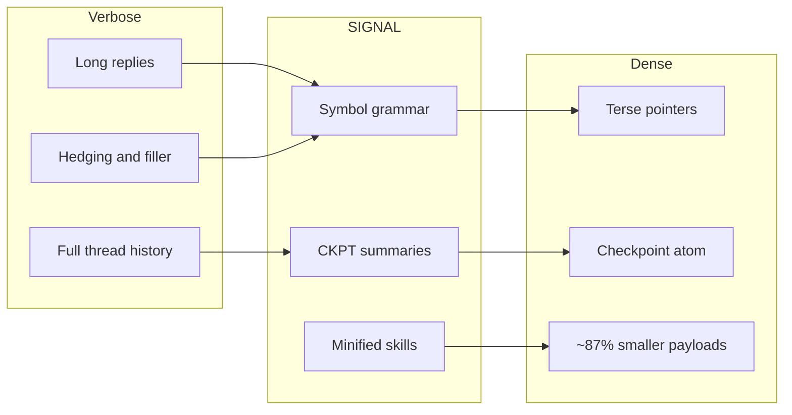
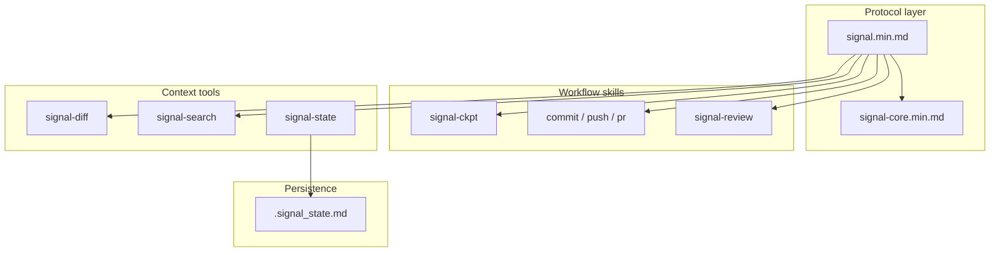
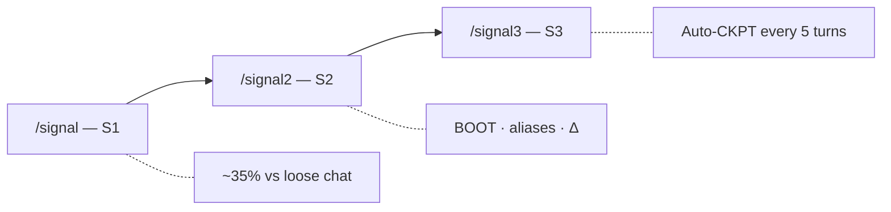

# 🌐 SIGNAL · v0.3.1

**Why burn the whole window when a tight spec fits?**  
Agent skills + symbol grammar + checkpoints. Fewer tokens on instructions, more room for code.


[Before / After](#before--after) · [Install](#install) · [Tiers](#tiers) · [Commands](#commands) · [Benchmark](#benchmark) · [Architecture](#architecture) · [Karpathy norms](#coding-norms-karpathy-style) · [Git & CI](#git-workflows--ci) · [Stars](#star-history)

---

**SIGNAL** is a **brutalist compression layer** for agentic workflows: minified `.min.md` skills, a small **symbol vocabulary** (`→` `∅` `Δ` `!` `[n]`), and **checkpoints** instead of pasting entire threads. Inspired by the idea that *dense* beats *polite* when the meter is running—same job, fewer tokens.

Repo · [github.com/mattbaconz/signal](https://github.com/mattbaconz/signal) · Protocol · [`skills/signal.min.md`](skills/signal.min.md) · Symbols · [`skills/signal-core.min.md`](skills/signal-core.min.md)

---

## Before / after


| 👤 **Verbose agent**                                                                                                                                                                                                       | 🌐 **SIGNAL**                                                                                                                                   |
| -------------------------------------------------------------------------------------------------------------------------------------------------------------------------------------------------------------------------- | ----------------------------------------------------------------------------------------------------------------------------------------------- |
| “I think the problem might be in `auth.js` around line 47. When the array is empty there could potentially be a null reference. You might want to consider adding a guard clause. I'm fairly confident this is the issue.” | `auth.js:47` · null ref · guard — same fix, **~7× fewer tokens** in the scripted benchmark.                                                     |
| Paste 10 turns of chat + tool noise into context so “nothing is lost.”                                                                                                                                                     | **CKPT atom**: project stack, progress, next step — transcript stays out of the window.                                                         |
| One giant `SKILL.md` tree + references forever.                                                                                                                                                                            | **Canonical `.md`** for humans, `**.min.md**` for the agent — **~87% smaller** across the seven main skill pairs (see [Benchmark](#benchmark)). |


---

## Install

```bash
npx skills add mattbaconz/signal
```

Global:

```bash
npx skills add mattbaconz/signal -y -g
```

**Quick start:** read [`skills/signal.min.md`](skills/signal.min.md) → pick a tier → pull in workflow skills (`signal-commit`, `signal-push`, …) only when needed. Canonical specs sit next to minified ones in [`skills/`](skills/).

---

## Why SIGNAL

Long prompts and hedging eat context. SIGNAL standardizes **how** you shrink: symbols instead of paragraphs, **`.signal_state.md`** for durable state, **signal-diff** / **signal-search** for summarized context instead of raw dumps.



---

## Tiers

Use `/signal`, `/signal2`, or `/signal3`.


| Tier   | You get                                  | Rough habit savings        |
| ------ | ---------------------------------------- | -------------------------- |
| **S1** | Symbols, no preamble, no hedge, terse    | ~35%                       |
| **S2** | S1 + BOOT, aliases, delta-friendly turns | another ~20% on top        |
| **S3** | S2 + **auto-checkpoint every 5 turns**   | long sessions stay bounded |


---

## Commands


| Command          | What it does                       |
| ---------------- | ---------------------------------- |
| `/signal`        | S1 — entry tier                    |
| `/signal2`       | S2 — strong default                |
| `/signal3`       | S3 — auto-CKPT                     |
| `/signal-commit` | Stage + conventional commit        |
| `/signal-push`   | Commit + push                      |
| `/signal-pr`     | Push + PR (`gh`)                   |
| `/signal-review` | One-line review, severity required |
| `/signal-state`  | `.signal_state.md`                 |
| `/signal-diff`   | Summarized changes                 |
| `/signal-search` | Summarized search                  |


---

## Symbol grammar (snippet)


| Symbol | Meaning               | Example              |
| ------ | --------------------- | -------------------- |
| `→`    | causes / produces     | `nullref→crash`      |
| `∅`    | none / remove / empty | `cache=∅`            |
| `Δ`    | change / diff         | `Δ+cache→~5ms`       |
| `!`    | required / must       | `!fix before deploy` |
| `[n]`  | confidence 0.0–1.0    | `fix logic [0.95]`   |


Full reference: [`skills/signal-core.min.md`](skills/signal-core.min.md).

---

## Benchmark

Heuristic: **`ceil(characters / 4)`** — not billed API tokens; good for comparing shapes.

SIGNAL v0.3.1 benchmark

### Scenarios (scripted)


| Scenario                     | Verbose | SIGNAL | Saved        |
| ---------------------------- | ------- | ------ | ------------ |
| A: 10-turn history vs CKPT   | ~167    | ~45    | ~73% · ~3.7× |
| B: Bug paragraph vs one line | ~51     | ~7     | ~86% · ~7.3× |
| C: Hedging vs `[conf]`       | ~8      | ~2     | ~75% · ~4×   |


### Skill pairs (canonical `.md` → `.min.md`)


| Pair              | Bytes (≈)          | Est. tok (≈)      | Shrink   |
| ----------------- | ------------------ | ----------------- | -------- |
| signal            | 2.8K → 0.7K        | ~712 → ~182       | ~75%     |
| signal-ckpt       | 5.6K → 0.7K        | ~1389 → ~163      | ~88%     |
| signal-commit     | 8.3K → 0.7K        | ~2071 → ~178      | ~91%     |
| signal-pr         | 4.7K → 0.5K        | ~1177 → ~130      | ~89%     |
| signal-push       | 3.7K → 0.5K        | ~936 → ~131       | ~86%     |
| signal-review     | 5.5K → 0.6K        | ~1378 → ~145      | ~90%     |
| signal-state      | 2.0K → 0.7K        | ~511 → ~163       | ~68%     |
| **7 pairs total** | **~32.7K → ~4.4K** | **~8173 → ~1090** | **~87%** |


Min-only helpers (`signal-core`, `signal-diff`, `signal-search`) ≈ **1.6K** bytes (~**389** est. tokens).

**Reproduce:**

```powershell
powershell -NoProfile -ExecutionPolicy Bypass -File .\scripts\benchmark.ps1
```

---

## Architecture



**Tier ladder:**



---

## Coding norms (Karpathy-style)

Tiers compress **chat**. For **code edits**, the bundle still points at **Karpathy-style** discipline: small diffs, clear assumptions, verify goals.


| Resource       | Link                                                                                                                                                                                                |
| -------------- | --------------------------------------------------------------------------------------------------------------------------------------------------------------------------------------------------- |
| Full norms     | [`references/karpathy-coding-norms.md`](references/karpathy-coding-norms.md)                                                                                                                        |
| In skills      | [`skills/signal.md`](skills/signal.md), [`skills/signal-core.min.md`](skills/signal-core.min.md) (`KarpathyNorms`), [`skills/signal-commit.min.md`](skills/signal-commit.min.md) (`followKarpathy`) |
| Host templates | [`templates/gemini-GEMINI.md`](templates/gemini-GEMINI.md), [`templates/claude-CLAUDE.md`](templates/claude-CLAUDE.md)                                                                              |


---

## Git workflows & CI


| Skill                                                        | Role                                                   |
| ------------------------------------------------------------ | ------------------------------------------------------ |
| [`skills/signal-commit.min.md`](skills/signal-commit.min.md) | Stage all, conventional commit (`--draft` / `--split`) |
| [`skills/signal-push.min.md`](skills/signal-push.min.md)     | Commit + push                                          |
| [`skills/signal-pr.min.md`](skills/signal-pr.min.md)         | Commit + push + `gh pr create`                         |


**CI:** [`.github/workflows/verify.yml`](.github/workflows/verify.yml) runs [`scripts/verify.ps1`](scripts/verify.ps1) on Windows for `main` and PRs.

---

## What's new in v0.3.1

- **Version alignment:** `signal_bundle_version` **0.3.1** across canonical skills, `gemini-extension.json`, Claude plugin, and marketplace metadata.
- **Path fix:** all Karpathy / checkpoint / boot-preset pointers use repo-root **`references/*`** (removed obsolete `signal/references/*` and `skills/signal/references/*`).
- **Docs:** new [`references/checkpoint.md`](references/checkpoint.md) describing benchmark CKPT fixtures; [`scripts/benchmark.ps1`](scripts/benchmark.ps1) and preview HTML reference it.
- **Chore:** `verify.ps1` user-facing error message typo (**SIGNAL** repo).

### Prior release — v0.3.0 (“Shrinking Session”)

- Minified `.min.md` skills, symbol grammar, `.signal_state.md`, `signal-diff` / `signal-search`, tiered activation. See [CHANGELOG.md](CHANGELOG.md).

---

## Repository layout

```
signal/
├── skills/              # *.md + *.min.md
├── assets/              # logos, benchmark art
├── templates/           # Gemini / Claude snippets
├── references/          # e.g. karpathy-coding-norms
├── scripts/             # benchmark.ps1, shrink.ps1, verify.ps1
├── gemini-signal/       # Gemini CLI extension
├── claude-signal/       # Claude Code plugin
├── hooks/
└── GEMINI.md
```

---

## Star History

[Star History Chart](https://www.star-history.com/?repos=mattbaconz%2Fsignal&type=date&legend=top-left)

---

*v0.3.1 — Shrinking Session. Brutalist token compression.*