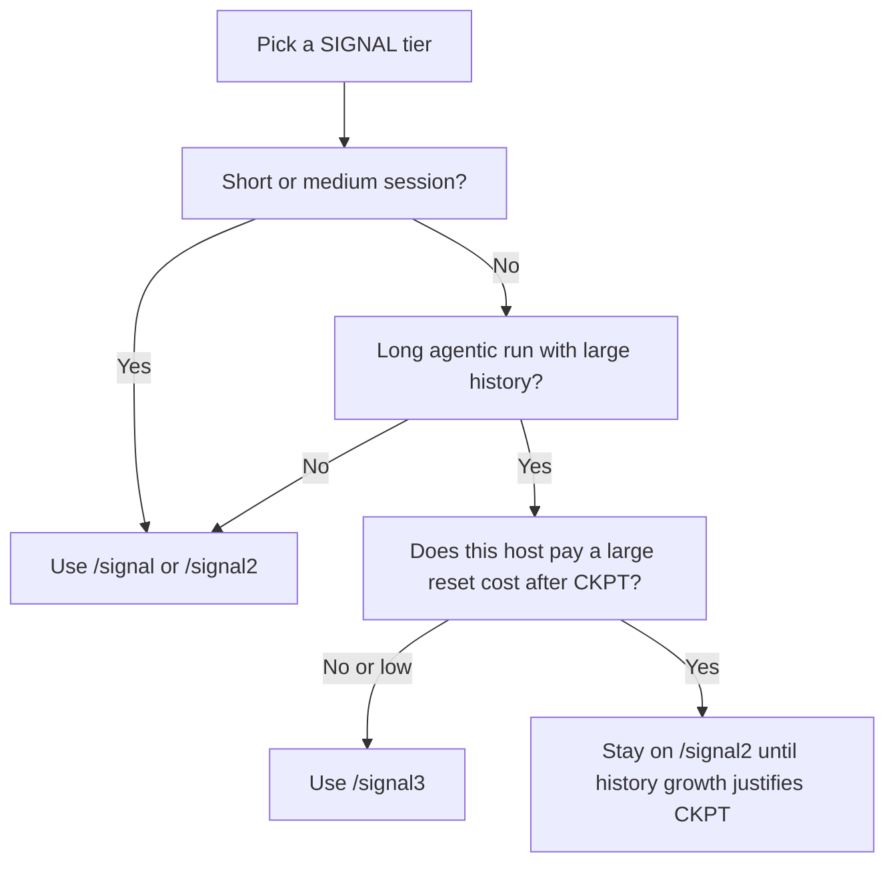

# SIGNAL

**Token-efficient agent answers (templates · symbols · checkpoints) and one-shot git workflows — [Agent Skills](https://agentskills.io/) for Claude Code, Cursor, Gemini CLI, Codex, and more.**

[v0.1.1](CHANGELOG.md) · [MIT](LICENSE) · [Discord](https://discord.gg/4Dkt9CaK8M) · Full protocol: `[signal/SKILL.md](signal/SKILL.md)`

**Token savings (typical ranges, not guarantees):** tier design targets are **~65%** (SIGNAL-1), **~80%** (SIGNAL-2), and **~90%+** on long sessions when SIGNAL-3 checkpoints dominate output cost vs verbose replies. Replacing a long transcript with one checkpoint line reached **~94%** fewer tokens than verbatim history in one representative run (~18×; rough estimate, ~4 chars/token). Per-turn wins vary by task; hosts can add large fixed overhead (e.g. session reset). See [Evidence](#evidence-what-we-measure), **[`docs/token-metrics.md`](docs/token-metrics.md)** (prompt vs output vs history), and the table below.

---

## Before / after


| Scenario                       | Without SIGNAL                                                                                                                                                                                                             | With SIGNAL                                                                                                  |
| ------------------------------ | -------------------------------------------------------------------------------------------------------------------------------------------------------------------------------------------------------------------------- | ------------------------------------------------------------------------------------------------------------ |
| Bug diagnosis                  | "The issue is in auth.js around line 47. There's a null reference error occurring when the array is empty. You should add a guard clause to handle this case. I'm fairly confident this is the root cause." *(~60 tokens)* | `auth.js:47                                                                                                  |
| Session state after 10 turns   | ~2,400 tokens of conversation history                                                                                                                                                                                      | `CKPT[2]: §project=api §stack=node+jwt progress=[login✓,refresh✓,logout/] next=finish logout` *(~35 tokens)* |
| "I'm fairly confident that..." | 6 tokens                                                                                                                                                                                                                   | `[0.95]` *(1 token)*                                                                                         |
| Architecture decision          | "There are several approaches you might consider. One possible option would be PostgreSQL, which offers ACID guarantees..." *(~80 tokens)*                                                                                 | `use_postgres                                                                                                |


---

## Install

```bash
npx skills add mattbaconz/signal
```

Install all skills globally without prompts: `npx skills add mattbaconz/signal -y -g` · See `npx skills add --help`.

**skills.sh:** The [public directory](https://skills.sh) reflects `npx skills` installs over time (no manual signup). To propose SIGNAL for the curated [awesome-agent-skills](https://github.com/VoltAgent/awesome-agent-skills) list, apply [`contrib/awesome-agent-skills-add-signal.patch`](contrib/awesome-agent-skills-add-signal.patch) and open a PR (steps in [`contrib/README.md`](contrib/README.md)).

**Also:** [full install options](#installation-options) (Gemini, manual paths, Windows) · [Verify](#verify-and-safe-first-use)

---

## Commands


| You want…                                  | Command          | Notes                                                  |
| ------------------------------------------ | ---------------- | ------------------------------------------------------ |
| Shorter replies, symbol grammar            | `/signal`        | No checkpointing                                       |
| + BOOT, aliases, delta-only turns          | `/signal2`       | Strong default for multi-turn                          |
| Long runs where **history** dominates cost | `/signal3`       | Mind [CLI boot tax](#when-to-use-which-tier-canonical) |
| Commit without writing a message           | `/signal-commit` | `--draft` / `--dry`                                    |
| Commit + push                              | `/signal-push`   |                                                        |
| Push + GitHub PR                           | `/signal-pr`     | Needs `[gh](https://cli.github.com/)`                  |
| Structured code review                     | `/signal-review` |                                                        |
| Manual session checkpoint                  | `/signal-ckpt`   | Auto every 5 turns in `/signal3`                       |


Per-host paths and activation: [Cross-tool porting](#cross-tool-porting).

---

**Table of contents**

1. [Problem and approach](#problem-and-approach)
2. [Skill catalog](#skill-catalog--what-ships-in-this-repo)
3. [Tier specification](#tier-specification-signal-1--2--3)
4. [When to use which tier](#when-to-use-which-tier-canonical)
5. [Compression layers](#compression-layers-summary)
6. [Installation options](#installation-options) (includes [maximize token savings](#maximize-token-savings))
7. [Cross-tool porting](#cross-tool-porting)
8. [Verify and safe first use](#verify-and-safe-first-use)
9. [Workflow skills (git) on Windows](#workflow-skills-git-on-windows)
10. [BOOT presets](#boot-presets)
11. [Rules of the road](#rules-of-the-road)
12. [Repository layout](#repository-layout)
13. [Releases and community](#releases-and-community)
14. [Further reading](#further-reading)

---

## Problem and approach

**Problem:** In agentic coding, **unstructured natural language compounds**. Every turn re-introduces tone, hedging, and repeated context. That inflates tokens, dilutes signal for the next model step, and makes long sessions expensive.

**Approach:** SIGNAL constrains **how** the model answers (templates, symbols, confidence as numbers, optional checkpoints) without asking you to abandon precision. Code stays verbatim; technical terms stay unabbreviated; uncertainty becomes `[conf]` instead of a paragraph.

**Scope:** SIGNAL optimizes **assistant output shape and session state representation**. It does not replace your editor, linter, or VCS — the `[signal-commit](#skill-catalog--what-ships-in-this-repo)` family wraps normal git and `[gh](https://cli.github.com/)` behavior.

---

## Skill catalog — what ships in this repo

These six directories are the **core bundle** versioned together as **v0.1.1**:


| Skill folder                       | Role                                                                                          | Loads when                                                                                         |
| ---------------------------------- | --------------------------------------------------------------------------------------------- | -------------------------------------------------------------------------------------------------- |
| `[signal/](signal/)`               | **Core protocol** — tiers, templates, BOOT, checkpoints, `SIGNAL_DRIFT` escape hatch          | User asks for compression, `/signal`, `/signal2`, `/signal3`, or long sessions where tokens matter |
| `[signal-commit/](signal-commit/)` | Stage all + commit with **Conventional Commits** message from diff; **no prompts** by default | “Just commit”, `/signal-commit`, commit without a message                                          |
| `[signal-push/](signal-push/)`     | Same as commit, then **push** (sets upstream on new branches)                                 | “Commit and push”, `/signal-push`                                                                  |
| `[signal-pr/](signal-pr/)`         | Same as push, then **open PR** via `gh`                                                       | `/signal-pr`, “open a PR”                                                                          |
| `[signal-review/](signal-review/)` | Review in **one line per issue**, severity required, compressed template                      | `/signal-review`, “review this”                                                                    |
| `[signal-ckpt/](signal-ckpt/)`     | **Manual** checkpoint — collapse history to ≤50-token atom                                    | `/signal-ckpt`, “checkpoint”; auto in SIGNAL-3                                                     |


Additional material in this repository:


| Path                             | Purpose                                                                                    |
| -------------------------------- | ------------------------------------------------------------------------------------------ |
| `[signal-state/](signal-state/)` | Optional companion skill (install if you use it; not part of the “six core” version stamp) |
| `[templates/](templates/)`       | Snippets to merge into project `**GEMINI.md`** / `**CLAUDE.md`** (`**gemini-GEMINI.min.md**` / `**claude-CLAUDE.min.md**` = fewest prompt tokens) |


Packaged installs: [Claude Code plugin and Gemini CLI extension](#claude-code-plugin-and-gemini-cli-extension) · [Workflow determinism](#workflow-determinism-signal-commit-family)

---

## Tier specification (SIGNAL-1 / 2 / 3)

Normative tier definitions live in `[signal/SKILL.md](signal/SKILL.md)`. Summary:


| Tier         | Trigger    | Active capabilities (incremental)              | Typical remaining output size*                   |
| ------------ | ---------- | ---------------------------------------------- | ------------------------------------------------ |
| **SIGNAL-1** | `/signal`  | Symbol grammar, filler drop, no preamble       | ~65% of unconstrained                            |
| **SIGNAL-2** | `/signal2` | + BOOT declarations, aliases, delta-only turns | ~80% savings vs verbose                          |
| **SIGNAL-3** | `/signal3` | All layers + **auto checkpoint every 5 turns** | ~90%+ on long sessions when checkpoints dominate |


Order-of-magnitude; actual savings depend on task and host. Do not treat percentages as guarantees — treat them as **design targets**.

**Choosing a tier:** use [When to use which tier (canonical)](#when-to-use-which-tier-canonical) below. Rule of thumb: default to `**/signal`** or `**/signal2`**; reserve `**/signal3`** for sessions where history growth justifies checkpointing.

---

## When to use which tier (canonical)

This section is the canonical answer to: **which SIGNAL tier should you use on this host, for this kind of session?**

The short version:

- Use `**/signal`** for everyday terse output.
- Use `**/signal2`** when you want stronger structure across a multi-turn session without checkpoint resets.
- Use `**/signal3`** only when the conversation history is large enough that checkpoint replacement is worth the host's reset cost.

### Default recommendation

For most real work, start with `**/signal**` or `**/signal2**`.

- `**/signal**` is the safest default for short tasks, single questions, and lightweight coding help.
- `**/signal2**` is the best default for longer back-and-forth work when you want BOOT defaults, aliases, and delta-only turns without introducing checkpoint behavior.
- `**/signal3**` is the specialist tier for deep, long-running agentic sessions where conversation history becomes the dominant cost.

If you are not sure, pick `**/signal2**` first.

### Why `/signal3` is not the default

`/signal3` adds checkpoint compression, which is SIGNAL's biggest lever on long sessions. The catch is that some hosts charge a large hidden cost when a checkpoint causes a fresh session.

If the host must replay its full system prompt, tool definitions, and workspace index on every new session, that reset can cost **~60k–80k tokens** before your actual work even resumes.

That means:

- If your history is still small, `/signal3` can be a net loss.
- If your history is large and keeps growing, `/signal3` can become the best option.

This is why SIGNAL should be chosen **per host** and **per session shape**, not as a one-size-fits-all default.




### Host guidance


| Host shape                                                                     | Recommended default                                                                  | Why                                                                                                                                                                         |
| ------------------------------------------------------------------------------ | ------------------------------------------------------------------------------------ | --------------------------------------------------------------------------------------------------------------------------------------------------------------------------- |
| IDE-embedded agent with one continuous conversation                            | `**/signal**` or `**/signal2**`, then consider `**/signal3**` for very long sessions | You usually get the benefit of terse output and structured turns immediately. Checkpoint behavior may be less punitive if the host does not fully reboot the agent context. |
| CLI agent that starts a fresh session after checkpoint boundaries              | `**/signal**` or `**/signal2**` by default                                           | A fresh session can replay a large framework payload, so `/signal3` only pays off after history gets very large.                                                            |
| Short debugging, review, or Q&A session                                        | `**/signal**`                                                                        | Lowest friction, immediate per-turn savings.                                                                                                                                |
| Multi-turn implementation or refactor session without huge context buildup yet | `**/signal2**`                                                                       | Better structure and delta-only turns without checkpoint reset risk.                                                                                                        |
| Deep agentic workflow with large accumulated history and repeated checkpoints  | `**/signal3**`                                                                       | Best chance to win once history replacement dominates host reset cost.                                                                                                      |


For installation paths and host-specific discovery details, see [Cross-tool porting](#cross-tool-porting) below.

### Practical decision rule

1. Start with `**/signal**` or `**/signal2**`.
2. Watch the session shape, not just the turn count.
3. Escalate to `**/signal3**` only when conversation history is clearly becoming the expensive part of the session.

Do not treat "5+ turns" by itself as the trigger. Five tiny turns are still tiny history.

### Evidence (what we measure)

**Primary (cumulative / history):** SIGNAL’s tier design targets **long, agentic sessions** where **chat history** and **verbose output** compound. In a **full clone** of this repo, run `benchmark/long-session/run_long_session.ps1` (see `benchmark/long-session/README.md` on disk) — baseline keeps full transcript each turn vs SIGNAL-3-style **CKPT** replacement on a schedule. That is the fairest **net** story for “SIGNAL vs verbose defaults” on Gemini CLI.

**Supporting (single-turn / style):** **Checkpoint vs. transcript** — same idea as the **~94% / ~18×** intro example: a multi-turn slice collapsed to a `CKPT` atom (rough token estimate, ~4 chars/token heuristic).

**Full host runs:** some CLIs replay a large payload on **session reset** (~60k–80k tokens mentioned above for punishing hosts), so net savings show up once history or per-turn output is large enough to outweigh that tax.

**Supplementary — Gemini CLI chess (paired cwd):** same `prompt.txt`, **`--approval-mode plan`**, **default pair**: baseline folder **without** project `GEMINI.md` vs SIGNAL folder **with** [`templates/gemini-GEMINI.md`](templates/gemini-GEMINI.md)-style defaults. One paired run (`gemini-3.1-pro-preview`, CLI 0.38.x): **~88% fewer characters** in the assistant reply with SIGNAL; **`tokens.total` from the CLI was ~13% higher** in the SIGNAL cwd because **prompt tokens** increased (project instructions + skills). That is a **single-turn** tradeoff, not the primary cumulative proof. Raw numbers: [`benchmark/benchmark chess/results_chess_compare.json`](benchmark/benchmark%20chess/results_chess_compare.json). Reproduce: [`benchmark/benchmark chess/run_chess_compare.ps1`](benchmark/benchmark%20chess/run_chess_compare.ps1) (may hit API **429** / capacity; retry later). For **both arms with project `GEMINI.md`**, use `-Pair EqualContext` — see that README.

**Definitions:** **[`docs/token-metrics.md`](docs/token-metrics.md)** — prompt vs output vs history; why `tokens.total` can rise when replies shrink.

Optional local `benchmark/` folders (gitignored) can hold your own scripts and raw numbers; nothing in git claims a single universal “score.”

---

## Compression layers (summary)

Full grammar and examples: `[signal/references/symbols.md](signal/references/symbols.md)`, `[signal/references/checkpoint.md](signal/references/checkpoint.md)`, `[signal/references/boot-presets.md](signal/references/boot-presets.md)`.


| Layer                   | What it reduces                                             |
| ----------------------- | ----------------------------------------------------------- |
| **Output templates**    | Prose → typed one-line atoms (`TMPL:bug`, `TMPL:arch`, …)   |
| **Checkpoint (`CKPT`)** | Full thread → ≤50-token state atom (when tier + host allow) |
| **BOOT declaration**    | Re-deciding format/tone every turn                          |
| **Aliases**             | Repeated long phrases → short stable keys                   |
| **Delta-only turns**    | Re-sending unchanged context                                |
| `**[conf]`**            | Hedging vocabulary → single confidence token                |


If the model cannot satisfy the active template, the spec’d escape is a single line: `SIGNAL_DRIFT: <reason>` (see core skill).

---

## Installation options

The quick path is at the top: `[Install](#install)`. Here: **GitHub source** must be `owner/repo` (not `signal` alone). The CLI discovers every top-level folder that contains `SKILL.md` (six core + `signal-state`).

```bash
npx skills add mattbaconz/signal
```

Non-interactive (all skills, user-level paths): `npx skills add mattbaconz/signal -y -g` · `npx skills add --help`

**Gemini CLI (from a checkout of this repo):**

```bash
gemini skills install /path/to/your/clone/signal --consent
```

**Manual copy** into your tool’s skills directory, for example:


| Tool / convention    | Typical location                                                                       |
| -------------------- | -------------------------------------------------------------------------------------- |
| Claude Code          | `~/.claude/skills/`                                                                    |
| Gemini CLI           | `~/.gemini/skills/` or `~/.agents/skills/` (same skill in **both** → conflict warning) |
| Cursor               | `~/.cursor/skills/`                                                                    |
| OpenAI Codex         | `~/.codex/skills/`                                                                     |
| Universal agents dir | `~/.agents/skills/`                                                                    |


Authoritative product list: [agentskills.io/home](https://agentskills.io/home).

**Windows — install all six core skills into standard folders at once:**

```powershell
powershell -ExecutionPolicy Bypass -File scripts\install-signal-all.ps1
```

For Gemini CLI, **skills alone do not change the default session tone or greeting** — merge [`templates/gemini-GEMINI.md`](templates/gemini-GEMINI.md) into project or user `GEMINI.md` for that. For **minimal** always-on text (fewest prompt tokens), use [`templates/gemini-GEMINI.min.md`](templates/gemini-GEMINI.min.md) instead.

**Skill conflict warnings (Gemini):** if the same skill exists in two folders the CLI searches (e.g. `~/.gemini/skills/` and `~/.agents/skills/`), remove one copy. The Windows install script puts skills under `**~/.agents/skills/`** (and Claude / Cursor / Codex paths) so you typically only need that tree.

**Do not duplicate packaged integrations:** if you use the **Gemini extension** ([`gemini-signal/`](gemini-signal/)) or **Claude plugin** ([`claude-signal/`](claude-signal/)), avoid also copying the same skill folders into another discovery path for the same host (for example `~/.gemini/skills/signal` **and** the extension’s bundled `skills/`). Pick one install method per tool so discovery does not load two copies.

### Claude Code plugin and Gemini CLI extension

| Package | What it is | Install |
| --------|------------|---------|
| **[`claude-signal/`](claude-signal/)** | Claude Code plugin (`.claude-plugin/plugin.json` + `skills/`). Slash skills are **namespaced**: `/signal:signal-commit`, etc. | Local: `claude --plugin-dir ./claude-signal`. Marketplace: add this repo, then `/plugin install signal@signal-suite` (see [`.claude-plugin/marketplace.json`](.claude-plugin/marketplace.json)). |
| **[`gemini-signal/`](gemini-signal/)** | Gemini CLI extension (`gemini-extension.json`, bundled `skills/`, optional `commands/` + `bin/` helpers). | Local: `gemini extensions link ./gemini-signal` or `gemini extensions install ./gemini-signal --consent`. Remote URL installs usually need `gemini-extension.json` at the **repo root**; nested paths work best via `link` or a local clone path. |

After editing any root skill folder, run `scripts/sync-integration-packages.ps1` (or `scripts/verify.ps1`, which runs sync first) so `gemini-signal/skills/` and `claude-signal/skills/` stay in sync.

### Workflow determinism (signal-commit family)

1. **Skill-only** — The model follows `SKILL.md` and uses git/tools. Depends on the host executing tools when you ask.
2. **Gemini slash commands** — [`gemini-signal/commands/`](gemini-signal/commands/) provides `/signal:commit` and `/signal:push` with injected `git` output; still follow the skill for message rules and completion.
3. **Bundled scripts** — From the extension directory, `gemini-signal/bin/run-commit.ps1` / `run-commit.sh` (and `run-push.*`) forward to the copied workflow scripts; run with **current directory = git repository root**.

### Maximize token savings

Canonical definitions: **[`docs/token-metrics.md`](docs/token-metrics.md)** (prompt vs output vs history, and how to read CLI `stats`).

This subsection covers **assistant output**, **injected context** (rules / `GEMINI.md` / `CLAUDE.md`), and **chat history** — all three matter for billed tokens.

SIGNAL only wins when **both** sides of the pipe stay lean: what the host injects every turn, and what the model emits.

**Assistant output (biggest lever)**

- Use `**/signal2`** for any session with back-and-forth: BOOT + aliases + **delta-only** turns beat repeating context every message.
- Declare `**REASON:∅`** in BOOT unless the user explicitly wants teaching or long rationale.
- Pick one **TMPL** per task (`TMPL:bug`, `TMPL:rev`, …) and stay in it; multi-paragraph answers burn tokens unless you `**SIGNAL_DRIFT`**.
- Replace hedging with `**[0.0–1.0]`** always; one number beats a sentence.
- After turn 1, **send only deltas** (what changed). Re-stating the plan every reply is pure waste.

**Input / persistent context (often overlooked)**

- Keep `**GEMINI.md`** / `**CLAUDE.md`** / project rules **short**. Paste [templates/gemini-GEMINI.min.md](templates/gemini-GEMINI.min.md) or [templates/claude-CLAUDE.min.md](templates/claude-CLAUDE.min.md) (thinnest per host) or a short block from the non-`.min` templates — not the full skill body.
- Do **not** duplicate the same instructions in three places (rules + user message + skill). The skill loads on demand; rules should **route** to SIGNAL, not mirror it.

**Measuring (Gemini CLI `stats` in `-o json`)**

- Compare **`prompt`** (input the model read) vs **`tokens.total`** (often includes both prompt-side and generation across internal hops). **Shorter replies** cut **generation/output**; **thicker `GEMINI.md`** raises **prompt**. Do not use **`tokens.total`** alone as a proxy for “output-only” savings when comparing skills.

**Long threads**

- When history is huge, use `**/signal-ckpt`** (manual) or `**/signal3`** (auto) only if [checkpoint savings outweigh reset cost](#when-to-use-which-tier-canonical) on your host.
- Optional: install `[signal-state/](signal-state/)` and maintain `**.signal_state.md`** so state lives on disk instead of being re-explained in chat.

**Reality check**

Savings are **maximized when the model follows the skill**. If the assistant drifts into prose, token count drifts with it — say **“follow SIGNAL strictly”** or re-issue `**/signal2`**.

---

## Cross-tool porting

SIGNAL uses the [Agent Skills](https://agentskills.io/) shape (`SKILL.md` + optional `references/`, `scripts/`). Each host loads skills from different directories and layers **persistent context** (always on) separately from **skills** (on-demand). Optimizing tokens means using the right layer per tool.

Before choosing a tier, read [When to use which tier (canonical)](#when-to-use-which-tier-canonical) above. The short version is: default to `**/signal`** or `**/signal2`** for most work, and reserve `**/signal3`** for sessions where conversation history is large enough to justify checkpoint behavior on the current host.

### Platform matrix


| Host                             | Persistent context (always injected)                                                                                                       | Skill discovery paths (typical)                                                                                                 | Notes                                                                                                                                                              |
| -------------------------------- | ------------------------------------------------------------------------------------------------------------------------------------------ | ------------------------------------------------------------------------------------------------------------------------------- | ------------------------------------------------------------------------------------------------------------------------------------------------------------------ |
| **Gemini CLI**                   | [GEMINI.md cascade](https://geminicli.com/docs/cli/gemini-md) (repo + `~/.gemini/GEMINI.md`) | `.gemini/skills/`, `.agents/skills/`, `~/.gemini/skills/`, `~/.agents/skills/` — [docs](https://geminicli.com/docs/cli/skills/) | Skills use **progressive disclosure**: only name/description until `activate_skill`. Prefer thin `GEMINI.md` + skill activation over pasting full BOOT every turn. |
| **Google Antigravity**           | Project/agent docs (see Antigravity docs)                                                                                                  | `<workspace>/.agent/skills/`, `~/.gemini/antigravity/skills/` — [docs](https://antigravity.google/docs/skills)                  | Do not duplicate the same skill in `~/.agents/skills/` **and** `~/.gemini/antigravity/skills/` — pick one global tree (the install script uses `.agents/skills/`). |
| **Claude Code**                  | `CLAUDE.md` and project rules                                                                                                              | `.claude/skills/`, `~/.claude/skills/` — [docs](https://code.claude.com/docs/en/skills)                                         | Same standard; metadata-first discovery.                                                                                                                           |
| **Cursor**                       | Rules + project context                                                                                                                    | `.cursor/skills/`, `.agents/skills/`, `~/.cursor/skills/` — [docs](https://cursor.com/docs/skills)                              | Also reads `.claude/skills/` for compatibility.                                                                                                                    |
| **OpenAI Codex** (app, CLI, IDE) | `AGENTS.md`, unified config — [learn](https://developers.openai.com/codex/learn/best-practices)                                            | `.codex/skills/`, `~/.codex/skills/` — per Cursor compatibility list                                                            | App and CLI share configuration patterns; use project + user scopes as documented for your install.                                                                |


**Takeaway:** Copy SIGNAL once per **scope** you care about (usually **user** `~/.*/skills/` for global, or **workspace** `.agents/skills/` in a repo). Do not duplicate giant instructions in both `GEMINI.md` and every user message — that **increases** tokens.

### Minimum viable activation (copy-paste)

Use the host's persistent context layer for a **thin default**, then let the `signal` skill handle the real protocol. The goal is to avoid pasting the full BOOT or `/signal3` activation text into every user message.

#### Gemini CLI

**Put this in:** project `GEMINI.md` or `~/.gemini/GEMINI.md`

Start from [`templates/gemini-GEMINI.md`](templates/gemini-GEMINI.md), from [`templates/gemini-GEMINI.min.md`](templates/gemini-GEMINI.min.md) for the smallest prompt footprint, or use this inline minimal block:

```md
## SIGNAL session defaults

- Default to SIGNAL-1-style terse output for normal replies, even without `/signal`.
- When the user asks for terse or low-token output, follow the `signal` skill.
- Prefer `/signal` or `/signal2` for normal work.
- Use `/signal3` only when checkpoint behavior is worth it on this host.
- Default style: terse, no preamble, no hedging sentences.
- Use `[0.0-1.0]` confidence where a claim is non-obvious.
- For greetings or small talk, use one short SIGNAL-style line.
- Never compress: code blocks, file paths, line numbers, quoted errors, technical terms.
- Before choosing a tier, read **When to use which tier (canonical)** in the bundle `README.md`.
```

Do not repeat this block in every prompt. Gemini already has `GEMINI.md` cascading for persistent defaults.

#### Claude Code

**Put this in:** project `CLAUDE.md`

Start from [`templates/claude-CLAUDE.md`](templates/claude-CLAUDE.md), from [`templates/claude-CLAUDE.min.md`](templates/claude-CLAUDE.min.md) for the smallest prompt footprint, or use this minimal block:

```md
## SIGNAL session defaults

- When the user asks for terse or low-token output, follow the `signal` skill.
- Prefer `/signal` or `/signal2` for normal work.
- Use `/signal3` only when checkpoint behavior is worth it on this host.
- Default style: terse, no preamble, no hedging sentences.
- Use `[0.0-1.0]` confidence where a claim is non-obvious.
- Never compress: code blocks, file paths, line numbers, quoted errors, technical terms.
- Before choosing a tier, read **When to use which tier (canonical)** in the bundle `README.md`.
```

Do not paste a long BOOT declaration into every prompt. Keep the persistent layer short and let Claude load the skill when needed.

#### Cursor

**Put this in:** a project rule, project context note, or workspace guidance file that stays active

Suggested minimal block:

```md
## SIGNAL session defaults

- Use the `signal` skill for terse or low-token work.
- Prefer `/signal` or `/signal2` unless the session is long enough to justify `/signal3`.
- Default style: terse, no preamble, no hedging sentences.
- Use `[0.0-1.0]` confidence where a claim is non-obvious.
- Never compress code blocks, paths, line numbers, quoted errors, or technical terms.
- See **When to use which tier (canonical)** in the bundle `README.md` before escalating to `/signal3`.
```

Do not restate this in every chat message. Cursor already has a persistent context layer for project-wide defaults.

#### OpenAI Codex

**Put this in:** project `AGENTS.md` for repo-wide defaults, plus install skills under `.codex/skills/` or `~/.codex/skills/`

Suggested minimal block:

```md
## SIGNAL session defaults

- Use the `signal` skill for terse or low-token output.
- Prefer `/signal` or `/signal2` for normal sessions.
- Use `/signal3` only when history replacement is clearly worth it on this host.
- Default style: terse, no preamble, no hedging sentences.
- Use `[0.0-1.0]` confidence where a claim is non-obvious.
- Never compress code blocks, file paths, line numbers, quoted errors, or technical terms.
- Before choosing a tier, read **When to use which tier (canonical)** in the bundle `README.md`.
```

Do not duplicate the same instructions in `AGENTS.md`, skill docs, and every user prompt. One thin persistent block is enough.

### Install SIGNAL into multiple agents (Windows)

Use `scripts/install-signal-all.ps1` from this repo. It **copies** each skill into the standard user skill folders (no symlinks, avoids `EPERM` on Windows without Developer Mode).

Manual one-liner per host (after cloning):

```bash
# Gemini CLI
gemini skills install /path/to/your/clone/signal --consent
# …repeat for signal-commit, signal-push, signal-pr, signal-review, signal-ckpt
```

Or copy directories into `~/.gemini/skills/`, `~/.claude/skills/`, etc., preserving folder names (`signal`, `signal-commit`, …).

### References (official / primary)

- Agent Skills standard — [agentskills.io](https://agentskills.io/)
- Gemini CLI — [Agent Skills](https://geminicli.com/docs/cli/skills/), [GEMINI.md](https://geminicli.com/docs/cli/gemini-md)
- Google Antigravity — [Agent Skills](https://antigravity.google/docs/skills)
- Claude Code — [Skills](https://code.claude.com/docs/en/skills)
- Cursor — [Agent Skills](https://cursor.com/docs/skills)
- OpenAI Codex — [Introducing the Codex app](https://openai.com/index/introducing-the-codex-app/), [Developers Codex](https://developers.openai.com/codex/)

---

## Verify and safe first use

From the repository root:

```powershell
powershell -NoProfile -ExecutionPolicy Bypass -File .\scripts\verify.ps1
```

This runs **`scripts/sync-integration-packages.ps1`** first, then **dry-run** smoke tests on the git scripts (including `gemini-signal/bin/run-commit.ps1`), and checks **relative links** in Markdown (canonical tree only; mirrored `gemini-signal/skills/` and `claude-signal/skills/` are excluded from link scans).

Stricter CI-style check (requires `[gh](https://cli.github.com/)` on `PATH`):

```powershell
powershell -NoProfile -ExecutionPolicy Bypass -File .\scripts\verify.ps1 -RequireGh -StrictPr
```

**Try a no-op commit** (prints intent only):

```powershell
powershell -NoProfile -ExecutionPolicy Bypass -File .\signal-commit\scripts\commit.ps1 --dry -- "chore(docs): example"
```

Version history: [`CHANGELOG.md`](CHANGELOG.md).

**Benchmark (deterministic token estimates):**

```powershell
powershell -NoProfile -ExecutionPolicy Bypass -File .\scripts\benchmark.ps1
```

Uses the same **ceil(charLength / 4)** heuristic as the docs; prints a few canned scenarios (10-line history vs checkpoint, verbose bug text vs SIGNAL line, hedging vs `[conf]`). Numbers are illustrative, not API-billed tokens.

---

## Workflow skills (git) on Windows

Native PowerShell scripts live beside the Bash versions:

- `signal-commit/scripts/commit.ps1`
- `signal-push/scripts/push.ps1`
- `signal-pr/scripts/pr.ps1`

Example:

```powershell
powershell -NoProfile -ExecutionPolicy Bypass -File .\signal-commit\scripts\commit.ps1 --dry -- "chore(docs): example message"
```

Use `.sh` on macOS, Linux, Git Bash, or WSL. All workflow skills support `**--draft**` (show without executing) and `**--dry**` (explain without side effects).

---

## BOOT presets

One-line session modes (full tables and `**BOOT:strict`** in `[signal/references/boot-presets.md](signal/references/boot-presets.md)`):

```text
BOOT:debug    → TMPL:bug + REASON:∅ + no_explain
BOOT:refactor → TMPL:rev + delta_turns + conf_required
BOOT:arch     → TMPL:arch + alternatives:conf<0.5_only
BOOT:review   → TMPL:rev + severity_required
BOOT:perf     → TMPL:perf + REASON:1line
```

---

## Rules of the road

Design rules for the core skills:

1. **No confirmation by default** — use `--draft` / `--dry` when you need review.
2. **Conventional Commits** for generated messages — one standard.
3. **Code blocks stay exact** — never “compress” code.
4. **Technical terms stay unabbreviated** — e.g. `polymorphism` stays `polymorphism`.
5. `**[conf]` replaces hedging** — no “it might be worth considering…”.
6. **SIGNAL’s own activation text stays compressed.**
7. **Escape hatches always exist** — `SIGNAL_DRIFT`, `--draft`, `--dry`.

---

## Repository layout

```
your-clone/                   ← repository root (folder name may differ, e.g. `signal`)
├── .gitignore
├── .claude-plugin/
│   └── marketplace.json      ← Claude Code marketplace catalog (plugin source: claude-signal/)
├── assets/
│   ├── signal-logo.png
│   ├── signal-icon-minimal.png
│   └── signal-demo.gif          ← optional; screen recording for README hero
├── README.md
├── CHANGELOG.md
├── docs/
│   └── token-metrics.md      ← prompt vs output vs history (reading CLI stats)
├── contrib/                  ← optional patches (e.g. awesome-agent-skills PR)
├── .github/workflows/verify.yml
├── gemini-signal/            ← Gemini CLI extension (gemini-extension.json, synced skills/)
├── claude-signal/            ← Claude Code plugin (synced skills/)
├── signal/
│   ├── SKILL.md
│   └── references/
├── signal-commit/
├── signal-push/
├── signal-pr/
├── signal-review/
├── signal-ckpt/
├── signal-state/             ← optional
├── templates/
└── scripts/
    ├── install-signal-all.ps1
    ├── sync-integration-packages.ps1
    ├── prepare-awesome-agent-skills-pr.ps1
    ├── benchmark.ps1
    └── verify.ps1
```

**Optional local-only files** (see `.gitignore`): e.g. private notes next to your clone.

---

## Releases and community

**Versioning:** Ship **`signal_bundle_version`** in core `SKILL.md` frontmatter with the tag you cut; add a section to [`CHANGELOG.md`](CHANGELOG.md); push an annotated git tag (`git tag -a v0.x.y -m "…"`); optional GitHub Release from that tag. Keep the three aligned per release.

- **GitHub release:** Tag **`v0.1.1`** is published on the repo. [Draft a release](https://github.com/mattbaconz/signal/releases/new?tag=v0.1.1&title=SIGNAL%20v0.1.1) (same tag), paste a short summary from [`CHANGELOG.md`](CHANGELOG.md), publish.
- **CI:** [Actions](https://github.com/mattbaconz/signal/actions) runs `scripts/verify.ps1` on pushes/PRs to `main`.
- **Discord:** [Join](https://discord.gg/4Dkt9CaK8M). Useful pins for mods: install `npx skills add mattbaconz/signal -y -g`, benchmark `powershell -NoProfile -ExecutionPolicy Bypass -File .\scripts\benchmark.ps1`, link to this repo.
- **skills.sh / awesome list:** Installs via `npx skills` help discovery on [skills.sh](https://skills.sh). **Checklist:** fork [VoltAgent/awesome-agent-skills](https://github.com/VoltAgent/awesome-agent-skills) → run [`scripts/prepare-awesome-agent-skills-pr.ps1`](scripts/prepare-awesome-agent-skills-pr.ps1) or apply [`contrib/awesome-agent-skills-add-signal.patch`](contrib/awesome-agent-skills-add-signal.patch) → push branch → open PR — details in [`contrib/README.md`](contrib/README.md).
- **Demo GIF (optional):** See [`assets/README.md`](assets/README.md) for recording steps; save as `assets/signal-demo.gif` for the README hero.

---

## Further reading


| Document                                   | Use it when                                               |
| ------------------------------------------ | --------------------------------------------------------- |
| `[docs/token-metrics.md](docs/token-metrics.md)` | Prompt vs output vs history; reading CLI `stats`        |
| `[signal/SKILL.md](signal/SKILL.md)`       | Exact activation strings, layers, `SIGNAL_DRIFT` protocol |
| `[signal/references/](signal/references/)` | Symbol grammar, BOOT presets, checkpoint format           |


---

*v0.1.1 — six core skills: `signal`, `signal-commit`, `signal-push`, `signal-pr`, `signal-review`, `signal-ckpt`; packaged Claude plugin + Gemini extension*

See `[LICENSE](LICENSE)` (MIT).