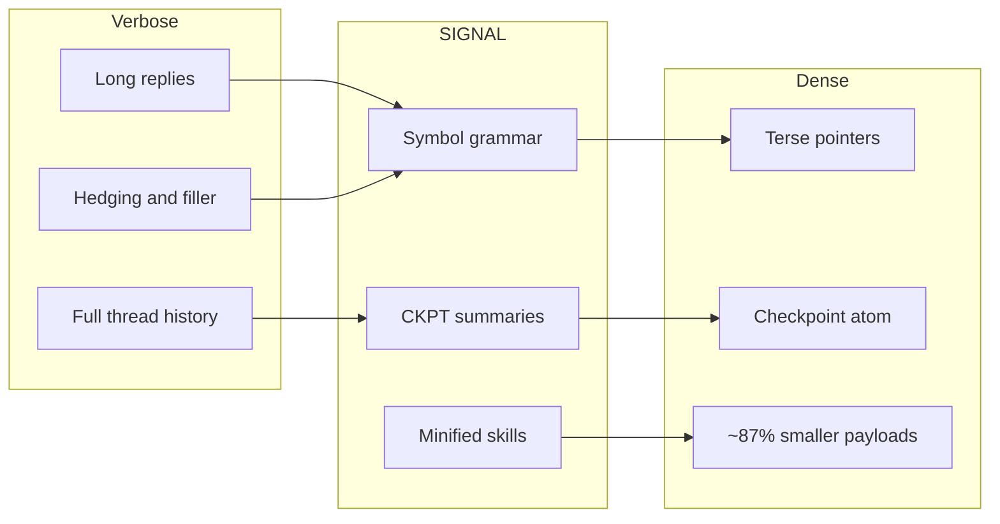
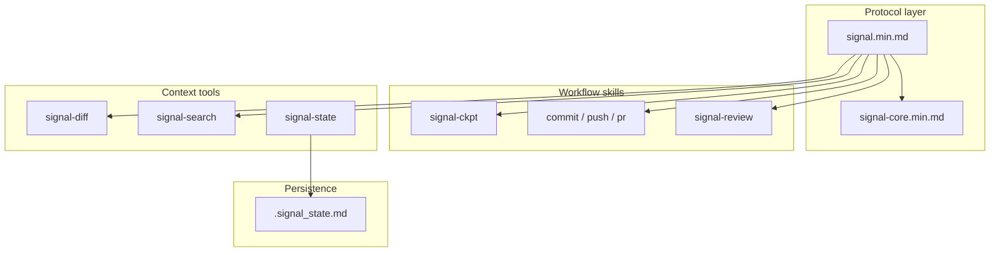
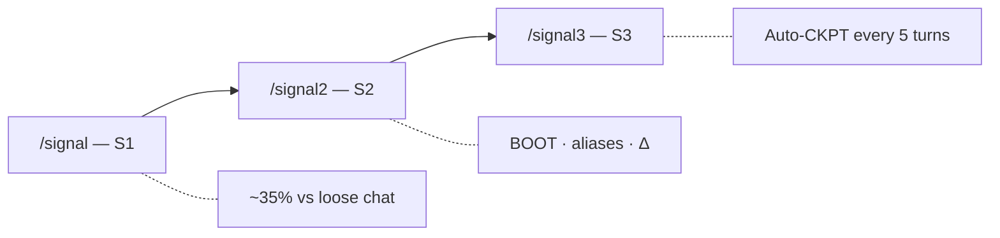
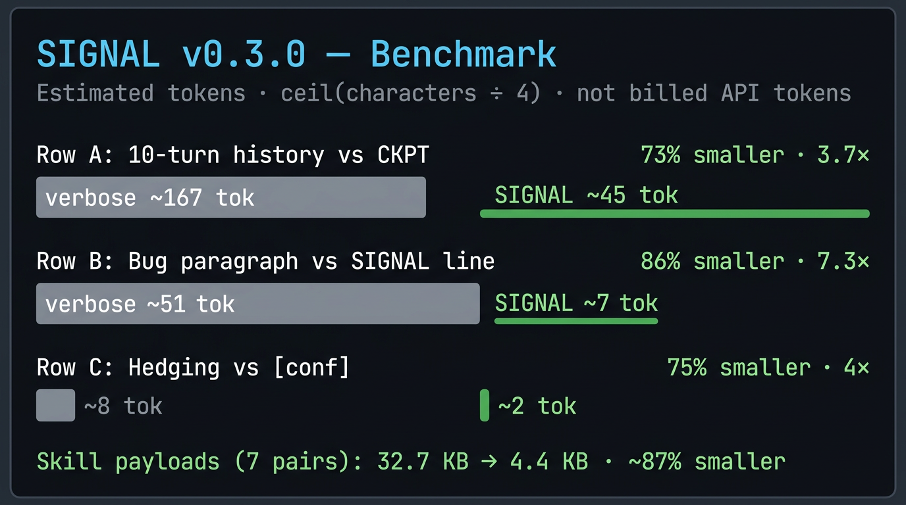

# ⚡ SIGNAL (v0.3.0)

**Less noise, more signal.** Brutalist token compression for agentic workflows: Symbol Grammar plus minified skills so instructions stay small and repeatable.

[Why SIGNAL](#why-signal) · [Quick start](#quick-start-for-developers) · [Architecture](#architecture) · [Coding norms (Karpathy)](#coding-norms-karpathy-style) · [Git workflows & CI](#git-workflows--ci) · [Tiers](#tiers) · [Commands](#commands) · [Symbol grammar](#symbol-grammar-snippet) · [Benchmark](#benchmark) · [Repository layout](#repository-layout) · [Install](#install)

---


|              |                                                                      |
| ------------ | -------------------------------------------------------------------- |
| **Repo**     | [github.com/mattbaconz/signal](https://github.com/mattbaconz/signal) |
| **Version**  | **v0.3.0** (Shrinking Session)                                       |
| **Protocol** | [`skills/signal.min.md`](skills/signal.min.md)                       |
| **Symbols**  | [`skills/signal-core.min.md`](skills/signal-core.min.md)             |


---

## Why SIGNAL

Long system prompts and verbose chat habits burn context. SIGNAL gives you a **shared compression protocol**: symbols instead of paragraphs, checkpoints instead of full transcripts, and **`.min.md` skills** that ship a fraction of the bytes of the canonical docs.



---

## Quick start for developers

1. **Install the skills** (see [Install](#install)) so your agent loads the `skills/` definitions.
2. **Read the protocol first:** [`skills/signal.min.md`](skills/signal.min.md) — triggers, tier rules, and pointers to other modules.
3. **Pick a tier** with `/signal`, `/signal2`, or `/signal3` (see [Tiers](#tiers)).
4. **Use workflow skills** when you need git or review: `signal-commit`, `signal-push`, `signal-pr`, `signal-review`, `signal-ckpt`, `signal-state`, `signal-diff`, `signal-search` (each has a `.min.md` under `skills/`).
5. **Optional:** run the [benchmark script](#reproduce-the-benchmark) locally to reproduce token estimates.

Canonical (readable) sources live beside minified ones in `skills/` — e.g. [`skills/signal-commit.md`](skills/signal-commit.md) vs [`skills/signal-commit.min.md`](skills/signal-commit.min.md). Prefer **`.min.md` in production context**; use the long form when editing or learning the spec.

---

## Architecture

How the pieces fit together for an integration author or power user:



**Tier ladder** (what each activation adds on top of the previous):



---

## Coding norms (Karpathy-style)

SIGNAL’s terse tiers apply to **chat compression**. For **implementation work** (edits, refactors, fixes), the bundle still points at **Karpathy-inspired norms**: think before coding, small diffs, clear assumptions, verifiable goals.

- **Full reference:** [`references/karpathy-coding-norms.md`](references/karpathy-coding-norms.md)
- **Where it shows up in skills:** [`skills/signal.md`](skills/signal.md) (Coding tasks), [`skills/signal-core.min.md`](skills/signal-core.min.md) (`KarpathyNorms`), and commit rules in [`skills/signal-commit.min.md`](skills/signal-commit.min.md) (`followKarpathy`).
- **Host templates** (Gemini / Claude snippets) repeat the same pointer so always-on rules stay aligned—see [`templates/gemini-GEMINI.md`](templates/gemini-GEMINI.md) and [`templates/claude-CLAUDE.md`](templates/claude-CLAUDE.md).

---

## Git workflows & CI

**Agent-facing git skills** (install via `npx skills add`; load the `.min.md` in context when you want zero-fluff git automation):

| Skill | Role |
| --- | --- |
| [`skills/signal-commit.min.md`](skills/signal-commit.min.md) | Stage all, conventional commit, optional `--draft` / `--split` |
| [`skills/signal-push.min.md`](skills/signal-push.min.md) | Commit + push |
| [`skills/signal-pr.min.md`](skills/signal-pr.min.md) | Commit + push + `gh pr create` |

Canonical long-form specs live beside them (`signal-commit.md`, etc.) if you need the full prose.

**Repo CI:** [`.github/workflows/verify.yml`](.github/workflows/verify.yml) runs on `main` / PRs and executes [`scripts/verify.ps1`](scripts/verify.ps1) on Windows (PowerShell, git, temp repos, `gh` checks)—so skill scripts and packaging stay honest as the tree changes.

---

## What's new in v0.3.0

- **Minified skills:** Core instructions compressed heavily (example: `signal-commit` canonical ~8.3KB vs min ~711B).
- **Symbol grammar:** Clause-style markers (`→` `⊕` `∅` `Δ` `!`, confidence `[n]`).
- **State-driven development:** `.signal_state.md` as a durable, atomic session anchor.
- **High-density tools:** `signal-diff` and `signal-search` for summarized context.
- **Testing discipline:** Logic changes require reproduction plus automated tests where applicable.

---

## Symbol grammar (snippet)


| Symbol | Meaning               | Example              |
| ------ | --------------------- | -------------------- |
| `→`    | causes / produces     | `nullref→crash`      |
| `∅`    | none / remove / empty | `cache=∅`            |
| `Δ`    | change / diff         | `Δ+cache→~5ms`       |
| `!`    | required / must       | `!fix before deploy` |
| `[n]`  | confidence 0.0–1.0    | `fix logic [0.95]`   |


Full table: [`skills/signal-core.min.md`](skills/signal-core.min.md).

---

## Tiers

Activate via `/signal`, `/signal2`, or `/signal3`.


| Tier   | Capabilities                                     | Typical savings                  |
| ------ | ------------------------------------------------ | -------------------------------- |
| **S1** | Symbols, drop preamble, drop hedge, terse output | ~35%                             |
| **S2** | S1 plus BOOT, aliases, delta-friendly turns      | ~20% more on top of habit change |
| **S3** | S2 plus **auto-checkpoint every 5 turns**        | keeps long sessions bounded      |


---

## Commands


| Command          | Role                        | Notes                                 |
| ---------------- | --------------------------- | ------------------------------------- |
| `/signal`        | S1 — short replies, symbols | Entry tier                            |
| `/signal2`       | S2 — structured multi-turn  | Strong default                        |
| `/signal3`       | S3 — history-heavy sessions | Auto-CKPT                             |
| `/signal-commit` | Stage and commit            | Conventional commits, minimal prompts |
| `/signal-push`   | Commit and push             |                                       |
| `/signal-pr`     | Push and open PR            | Needs `gh` CLI                        |
| `/signal-review` | One-line review format      | Severity required                     |
| `/signal-state`  | Persistent state            | Writes `.signal_state.md`             |
| `/signal-diff`   | Summarized changes          | No raw code dumps                     |
| `/signal-search` | Summarized search           | High-density results                  |


---

## Benchmark

Estimated tokens use **`ceil(character_count / 4)`** (rough heuristic; not the same as provider billed tokens).



### Scenario benchmark (scripted fixtures)


| Scenario                            | Verbose | SIGNAL | Saved | Ratio                  |
| ----------------------------------- | ------- | ------ | ----- | ---------------------- |
| A: 10-turn history vs checkpoint    | ~167    | ~45    | ~122  | ~73% smaller (~3.7×) |
| B: Bug paragraph vs one SIGNAL line | ~51     | ~7     | ~44   | ~86% smaller (~7.3×) |
| C: Hedging vs `[conf]`              | ~8      | ~2     | ~6    | ~75% smaller (~4×)   |


### Skill payload shrink (`skills/` canonical `.md` → `.min.md`)


| Pair              | Bytes (approx.)    | Est. tokens (approx.) | Shrink   |
| ----------------- | ------------------ | --------------------- | -------- |
| signal            | 2.8K → 0.7K        | ~712 → ~182           | ~75%     |
| signal-ckpt       | 5.6K → 0.7K        | ~1389 → ~163          | ~88%     |
| signal-commit     | 8.3K → 0.7K        | ~2071 → ~178          | ~91%     |
| signal-pr         | 4.7K → 0.5K        | ~1177 → ~130          | ~89%     |
| signal-push       | 3.7K → 0.5K        | ~936 → ~131           | ~86%     |
| signal-review     | 5.5K → 0.6K        | ~1378 → ~145          | ~90%     |
| signal-state      | 2.0K → 0.7K        | ~511 → ~163           | ~68%     |
| **7 pairs total** | **~32.7K → ~4.4K** | **~8173 → ~1090**     | **~87%** |


Min-only helpers (`signal-core`, `signal-diff`, `signal-search`) add ~1.6K raw bytes (~389 est. tokens).

### Reproduce the benchmark

From the repo root (Windows PowerShell):

```powershell
powershell -NoProfile -ExecutionPolicy Bypass -File .\scripts\benchmark.ps1
```

Real sessions vary by model tokenizer, tool output, and host system prompts.

---

## Repository layout

```
signal/
├── skills/                    # Canonical + minified skills (*.md / *.min.md)
├── assets/                    # Benchmark art, previews
├── templates/                 # Host snippets (Gemini, Claude, etc.)
├── scripts/                   # benchmark.ps1, shrink.ps1, verify.ps1, …
├── gemini-signal/             # Gemini CLI extension
├── claude-signal/             # Claude Code plugin
├── hooks/                     # Optional session hooks
└── GEMINI.md                  # Root context file (v0.3.0)
```

---

## Install

```bash
npx skills add mattbaconz/signal
```

Global install:

```bash
npx skills add mattbaconz/signal -y -g
```

---

*v0.3.0 — The Shrinking Session. Brutalist token compression.*