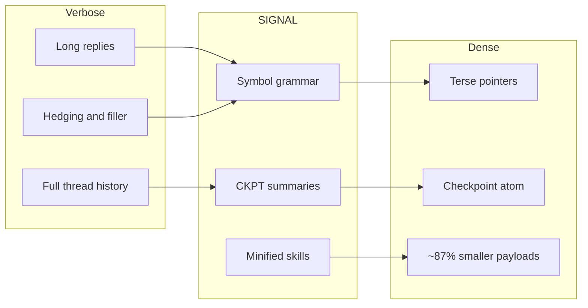
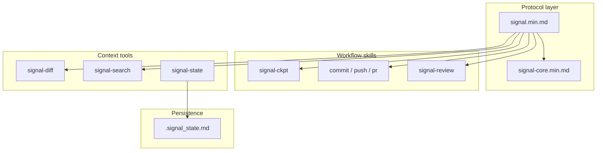
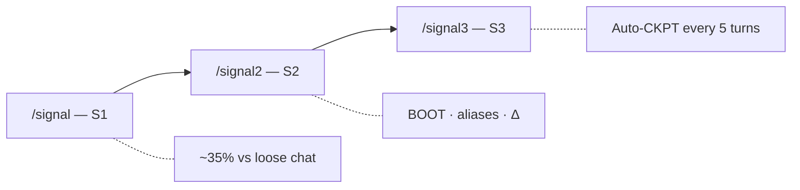

<p align="center">
  
</p>

<h1 align="center">🌐 SIGNAL · v0.3.1</h1>

<p align="center"><strong>Why burn the whole window when a tight spec fits?</strong></p>

<p align="center">Fewer tokens on instructions. More room for code. Agent skills + symbol grammar + checkpoints.</p>

<p align="center">
  <a href="https://github.com/mattbaconz/signal/stargazers"></a>
  <a href="LICENSE"></a>
  <a href="https://github.com/mattbaconz/signal/commits/main"></a>
  <a href="https://github.com/mattbaconz/signal/actions"></a>
  
</p>

<p align="center">
  <a href="#demo">Demo</a> ·
  <a href="#before--after">Before / After</a> ·
  <a href="#install">Install</a> ·
  <a href="#commands">Commands</a> ·
  <a href="#repo-map">Repo map</a> ·
  <a href="#tiers">Tiers</a> ·
  <a href="#benchmark">Benchmark</a> ·
  <a href="#architecture">Architecture</a> ·
  <a href="#coding-norms-karpathy-style">Karpathy norms</a> ·
  <a href="#git-workflows--ci">Git &amp; CI</a> ·
  <a href="#changelog">Changelog</a> ·
  <a href="#star-history">Stars</a> ·
  <a href="#maintainers">Maintainers</a>
</p>

<p align="center">
  <code>skills/</code> <em>(source)</em> ·
  <code>gemini-signal/</code> ·
  <code>claude-signal/</code> <em>(mirrored hosts)</em>
  — <strong>you are here:</strong> clone root
</p>

---

**SIGNAL** is a **brutalist compression layer** for agentic workflows: minified `.min.md` skills, a small **symbol vocabulary** (`→` `∅` `Δ` `!` `[n]`), and **checkpoints** instead of pasting entire threads. *Dense beats polite when the meter is running.*

Repo · [github.com/mattbaconz/signal](https://github.com/mattbaconz/signal) · Protocol · [`skills/signal.min.md`](skills/signal.min.md) · Symbols · [`skills/signal-core.min.md`](skills/signal-core.min.md)

**Latest changes:** [CHANGELOG.md](CHANGELOG.md) (v0.3.1 patch notes, v0.3.0 “Shrinking Session”, and earlier). **Contributing / min skills:** [CONTRIBUTING.md](CONTRIBUTING.md).

---

## Demo


**Figure:** scripted scenario savings (A–C), aggregate **`.md` → `.min.md`** skill payload shrink (~87% on seven pairs), and one **live Gemini CLI** row (single-turn `EqualContext` chess harness — `tokens.total` vs matched `prompt_tokens` vs reply length). Heuristic token estimates use **`ceil(characters / 4)`** for scenarios and skills; live row uses API-reported stats ([`docs/token-metrics.md`](docs/token-metrics.md)). Full tables: [Benchmark](#benchmark). Reproduce: [`scripts/benchmark.ps1`](scripts/benchmark.ps1); live: [`benchmark/README.md`](benchmark/README.md).

---

## Before / after

| 👤 **Verbose agent** | 🌐 **SIGNAL** |
| --- | --- |
| “I think the problem might be in `auth.js` around line 47…” | `auth.js:47` · null ref · guard — **~7× fewer tokens** in the scripted benchmark. |
| Paste 10 turns of chat + tool noise into context. | **CKPT atom**: stack, progress, next step — transcript stays out of the window. |
| One giant `SKILL.md` tree + references forever. | **Canonical `.md`** for humans, **`.min.md`** for the agent — **~87%** smaller on the seven main pairs ([Benchmark](#benchmark)). |

---

## Install

```bash
npx skills add mattbaconz/signal
```

Global:

```bash
npx skills add mattbaconz/signal -y -g
```

**Quick start:** read [`skills/signal.min.md`](skills/signal.min.md) → pick a tier → pull in workflow skills (`signal-commit`, `signal-push`, …) only when needed.

---

## Commands

| Command | What it does |
| --- | --- |
| `/signal` | S1 — entry tier |
| `/signal2` | S2 — strong default |
| `/signal3` | S3 — auto-CKPT |
| `/signal-commit` | Stage + conventional commit |
| `/signal-push` | Commit + push |
| `/signal-pr` | Push + PR (`gh`) |
| `/signal-review` | One-line review, severity required |
| `/signal-state` | `.signal_state.md` |
| `/signal-diff` | Summarized changes |
| `/signal-search` | Summarized search |

Tier detail: [Tiers](#tiers).

---

## Repo map

There is **no** legacy top-level `signal/` directory in this repo—ignore older docs that referred to it. This table is what you actually open after cloning.

| Location | What it is | You need it if… |
| --- | --- | --- |
| [`skills/`](skills/) | **Canonical** skill specs: `*.md` (readable) + `*.min.md` (dense) | You install via `npx skills add` or copy skills into an agent |
| [`gemini-signal/`](gemini-signal/), [`claude-signal/`](claude-signal/) | **Mirrored** host extension layouts (`SKILL.md` per tool) | You ship the Gemini CLI or Claude Code plugin from this tree |
| [`references/`](references/) | Shared refs (symbols, Karpathy norms, benchmarks, checkpoint notes) | You cite norms or symbols |
| [`templates/`](templates/) | Snippets to merge into a **project’s** GEMINI / CLAUDE files | You integrate SIGNAL into an app repo |
| [`scripts/`](scripts/) | `shrink.ps1`, `sync-integration-packages.ps1`, `verify.ps1`, `benchmark.ps1` | You contribute or verify locally ([CONTRIBUTING.md](CONTRIBUTING.md)) |

---

## Why SIGNAL

Long prompts and hedging eat context. SIGNAL standardizes **how** you shrink: symbols instead of paragraphs, **`.signal_state.md`** for durable state, **signal-diff** / **signal-search** for summarized context instead of raw dumps.



**Cumulative** transcript savings (baseline vs checkpoint-style history) are covered in [`benchmark/README.md`](benchmark/README.md) (`benchmark/long-session/` after a full clone). **Prompt vs output vs `tokens.total`** — hosts report different scopes; see [`docs/token-metrics.md`](docs/token-metrics.md).

---

## Tiers

Use `/signal`, `/signal2`, or `/signal3`.

| Tier | You get | Rough habit savings |
| --- | --- | --- |
| **S1** | Symbols, no preamble, no hedge, terse | ~35% |
| **S2** | S1 + BOOT, aliases, delta-friendly turns | another ~20% on top |
| **S3** | S2 + **auto-checkpoint every 5 turns** | long sessions stay bounded |

---

## Symbol grammar (snippet)

| Symbol | Meaning | Example |
| --- | --- | --- |
| `→` | causes / produces | `nullref→crash` |
| `∅` | none / remove / empty | `cache=∅` |
| `Δ` | change / diff | `Δ+cache→~5ms` |
| `!` | required / must | `!fix before deploy` |
| `[n]` | confidence 0.0–1.0 | `fix logic [0.95]` |

Full reference: [`skills/signal-core.min.md`](skills/signal-core.min.md).

---

## Benchmark

Same chart as [Demo](#demo); numbers below are the tables behind it.

Heuristic: **`ceil(characters / 4)`** — not billed API tokens; good for comparing shapes.

### Reading the numbers

[`docs/token-metrics.md`](docs/token-metrics.md) explains why **`tokens.total`** can rise when you add project instructions while replies get shorter (compare **prompt** and **output** separately). For **multi-turn / cumulative** proof, run **`benchmark/long-session/`** ([`benchmark/README.md`](benchmark/README.md)) in a full clone—the tables below are reproducible snapshots from [`scripts/benchmark.ps1`](scripts/benchmark.ps1), not a substitute for long-session measurement.

### Scenarios (scripted)

| Scenario | Verbose | SIGNAL | Saved |
| --- | ---: | ---: | --- |
| A: 10-turn history vs CKPT | ~167 | ~45 | ~73% · ~3.7× |
| B: Bug paragraph vs one line | ~51 | ~7 | ~86% · ~7.3× |
| C: Hedging vs `[conf]` | ~8 | ~2 | ~75% · ~4× |

### Skill pairs (canonical `.md` → `.min.md`)

| Pair | Bytes (≈) | Est. tok (≈) | Shrink |
| --- | --- | --- | --- |
| signal | 2.8K → 0.7K | ~712 → ~182 | ~75% |
| signal-ckpt | 5.6K → 0.7K | ~1389 → ~163 | ~88% |
| signal-commit | 8.3K → 0.7K | ~2071 → ~178 | ~91% |
| signal-pr | 4.7K → 0.5K | ~1177 → ~130 | ~89% |
| signal-push | 3.7K → 0.5K | ~936 → ~131 | ~86% |
| signal-review | 5.5K → 0.6K | ~1378 → ~145 | ~90% |
| signal-state | 2.0K → 0.7K | ~511 → ~163 | ~68% |
| **7 pairs total** | **~32.7K → ~4.4K** | **~8173 → ~1090** | **~87%** |

Min-only helpers (`signal-core`, `signal-diff`, `signal-search`) ≈ **1.6K** bytes (~**389** est. tokens).

### Live Gemini (representative single-turn)

From [`benchmark/benchmark chess/run_chess_compare.ps1`](benchmark/benchmark%20chess/run_chess_compare.ps1) **`-Pair EqualContext`** (matched `GEMINI.md` ~289 vs ~296 chars). Model **`gemini-3.1-pro-preview`**. *Totals mix prompt + generation — when prompt is large, `tokens.total` moves a little even if the reply shrinks a lot.*

| Metric | Baseline | SIGNAL-style | Notes |
| --- | ---: | ---: | --- |
| `tokens.total` (max per model) | ~9,039 | ~8,333 | ~**7.8%** lower |
| `prompt_tokens` | ~8,060 | ~8,061 | Matched context (fair pair) |
| Reply (chars) | ~1,823 | ~604 | ~**67%** fewer chars |

### Reproduce

**Live** (Gemini CLI on `PATH`, auth required — refreshes JSON under `benchmark/benchmark chess/`):

```powershell
powershell -NoProfile -ExecutionPolicy Bypass -File .\benchmark\run.ps1 -Mode Chess -Pair EqualContext
```

**Static** (heuristic scenarios; no API):

```powershell
powershell -NoProfile -ExecutionPolicy Bypass -File .\scripts\benchmark.ps1
```

---

## Architecture



**Tier ladder:**



---

## Coding norms (Karpathy-style)

**Tiers** shape **assistant chat** (symbols, templates, checkpoints). **Karpathy-style norms** shape **implementation work** (how you edit code and ship commits): orthogonal axes—activating `/signal3` does not replace surgical diffs or explicit assumptions.

Norms in brief (canonical list: [`references/karpathy-coding-norms.md`](references/karpathy-coding-norms.md)):

1. **Assumptions** — explicit over implicit; say when unsure.
2. **Simplicity** — avoid over-engineering.
3. **Surgical diffs** — minimal changes tied to the goal.
4. **Verifiable goals** — reproduce, test, or verify where it matters.
5. **No filler** — skip “here is the code”; show the code.

| Resource | Link |
| --- | --- |
| Full norms | [`references/karpathy-coding-norms.md`](references/karpathy-coding-norms.md) |
| In skills | [`skills/signal.md`](skills/signal.md), [`skills/signal-core.min.md`](skills/signal-core.min.md) (`KarpathyNorms`), [`skills/signal-commit.min.md`](skills/signal-commit.min.md) (`followKarpathy`) |
| Host templates | [`templates/gemini-GEMINI.md`](templates/gemini-GEMINI.md), [`templates/claude-CLAUDE.md`](templates/claude-CLAUDE.md) |

---

## Git workflows & CI

| Skill | Role |
| --- | --- |
| [`skills/signal-commit.min.md`](skills/signal-commit.min.md) | Stage all, conventional commit (`--draft` / `--split`) |
| [`skills/signal-push.min.md`](skills/signal-push.min.md) | Commit + push |
| [`skills/signal-pr.min.md`](skills/signal-pr.min.md) | Commit + push + `gh pr create` |

**CI:** [`.github/workflows/verify.yml`](.github/workflows/verify.yml) runs [`scripts/verify.ps1`](scripts/verify.ps1) on Windows for `main` and PRs.

---

## Changelog

All releases: [CHANGELOG.md](CHANGELOG.md).

---

## Repository layout (clone root)

```
./
├── skills/              # canonical *.md + *.min.md (edit here; see CONTRIBUTING.md)
├── assets/              # logos, benchmark art, GIF instructions
├── references/          # symbols, Karpathy norms, benchmarks, checkpoint notes
├── templates/           # Gemini / Claude merge snippets
├── scripts/             # benchmark.ps1, shrink.ps1, verify.ps1, sync-integration-packages.ps1
├── gemini-signal/       # Gemini CLI extension (mirrored from skills/)
├── claude-signal/       # Claude Code plugin (mirrored from skills/)
├── hooks/
└── GEMINI.md            # root context (synced from gemini-signal/)
```

---

## Star History

[Star History Chart](https://www.star-history.com/?repos=mattbaconz%2Fsignal&type=date&legend=top-left)

---

## Maintainers

**GitHub Release:** Publish a release from tag **`v0.3.1`** so the sidebar shows a current release (changelog text can match [CHANGELOG.md](CHANGELOG.md) § v0.3.1). With [GitHub CLI](https://cli.github.com/):  
`gh release create v0.3.1 --title "SIGNAL v0.3.1" --notes-file CHANGELOG.md`  
(edit notes or paste the v0.3.1 section only if you prefer).

**GitHub Topics:** Repo → **Settings → General → Topics**. Suggested tags:  
`agent-skills`, `token-compression`, `cursor`, `llm`, `developer-tools`, `gemini-cli`, `claude-code`, `opensource`, `ai-agents`, `prompt-engineering`.

---

*v0.3.1 — Shrinking Session. Brutalist token compression.*
