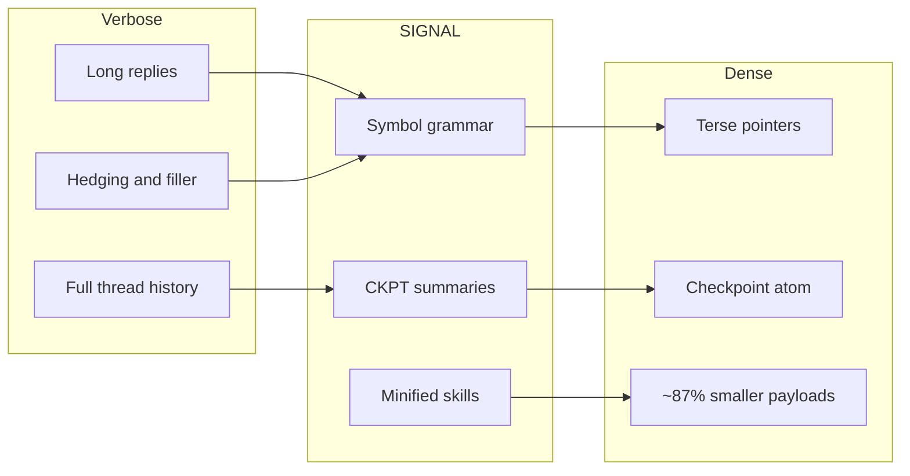
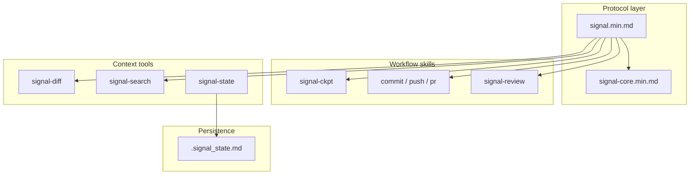
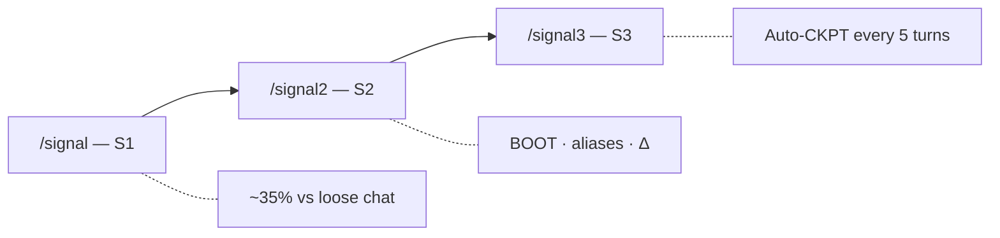



# SIGNAL · v0.3.2

**Less prompt noise. More room for code.**  
Agent skills that default to dense output: minified `.min.md` payloads, symbol shorthand, optional checkpoints.


### At a glance


| Topic                 | Summary                                                                                                                                                             |
| --------------------- | ------------------------------------------------------------------------------------------------------------------------------------------------------------------- |
| **What you get**      | Shorter **instructions + replies** in the agent; **checkpoints** (S3) instead of pasting full thread history when you want them.                                    |
| **What you run**      | `npx skills add mattbaconz/signal` → `**/signal`** (light) · `**/signal2**` (default) · `**/signal3**` (auto-CKPT).                                                 |
| **What this tree is** | `**skills/`** = source specs you edit. `**gemini-signal/**` · `**claude-signal/**` = mirrored host packages (don’t hand-edit; see [CONTRIBUTING](CONTRIBUTING.md)). |


Protocol entrypoints: `[skills/signal.min.md](skills/signal.min.md)` · symbols `[skills/signal-core.min.md](skills/signal-core.min.md)` · repo [github.com/mattbaconz/signal](https://github.com/mattbaconz/signal) · releases [CHANGELOG.md](CHANGELOG.md)

[Demo](#demo) · [Install](#install) · [Commands](#commands) · [Benchmark](#benchmark) · [Repo map](#repo-map) · [Architecture](#architecture) · [Changelog](#changelog)

[Before / after](#before--after) · [Tiers](#tiers) · [Karpathy norms](#coding-norms-karpathy-style) · [Git & CI](#git-workflows--ci) · [Stars](#star-history)

---

## Demo

SIGNAL benchmark — skill shrink, live reply savings, live Gemini snapshot

**What to trust first:** **~87% smaller** skill payloads on disk (seven `.md` → `.min.md` pairs, reproducible) and **~67% fewer characters** in the **live** assistant reply (Gemini CLI JSON, EqualContext — matched `prompt_tokens`). `**tokens.total`** on that same single-turn run only moves **~8%** because **prompt tokens (~8k) dominate the sum** — that is expected, not a failed headline. Details: [Benchmark](#benchmark) · [docs/token-metrics.md](docs/token-metrics.md).

**What’s illustration:** scenarios A–C use `ceil(characters / 4)` (not billed API tokens) — good for shape, not primary “proof” vs hosts that report real tokenizer counts.

**Reproduce:** [scripts/benchmark.ps1](scripts/benchmark.ps1) (static) · [benchmark/run.ps1](benchmark/run.ps1) / [benchmark/README.md](benchmark/README.md) (live + long-session).

---

## Before / after


| 👤 **Verbose agent**                                        | 🌐 **SIGNAL**                                                                                                                     |
| ----------------------------------------------------------- | --------------------------------------------------------------------------------------------------------------------------------- |
| “I think the problem might be in `auth.js` around line 47…” | `auth.js:47` · null ref · guard — **~7× fewer tokens** in the scripted benchmark.                                                 |
| Paste 10 turns of chat + tool noise into context.           | **CKPT atom**: stack, progress, next step — transcript stays out of the window.                                                   |
| One giant `SKILL.md` tree + references forever.             | **Canonical `.md`** for humans, `**.min.md**` for the agent — **~87%** smaller on the seven main pairs ([Benchmark](#benchmark)). |


---

## Install

```bash
npx skills add mattbaconz/signal
```

Global:

```bash
npx skills add mattbaconz/signal -y -g
```

**After install:** open `[skills/signal.min.md](skills/signal.min.md)`, pick **S1 / S2 / S3**, add workflow skills (`signal-commit`, …) only when you need them.

---

## Commands


| Command          | What it does                       |
| ---------------- | ---------------------------------- |
| `/signal`        | S1 — entry tier                    |
| `/signal2`       | S2 — strong default                |
| `/signal3`       | S3 — auto-CKPT                     |
| `/signal-commit` | Stage + conventional commit        |
| `/signal-push`   | Commit + push                      |
| `/signal-pr`     | Push + PR (`gh`)                   |
| `/signal-review` | One-line review, severity required |
| `/signal-state`  | `.signal_state.md`                 |
| `/signal-diff`   | Summarized changes                 |
| `/signal-search` | Summarized search                  |


Tier detail: [Tiers](#tiers).

---

## Repo map

There is **no** legacy top-level `signal/` directory in this repo—ignore older docs that referred to it. This table is what you actually open after cloning.


| Location                                                               | What it is                                                                   | You need it if…                                                       |
| ---------------------------------------------------------------------- | ---------------------------------------------------------------------------- | --------------------------------------------------------------------- |
| `[skills/](skills/)`                                                   | **Canonical** skill specs: `*.md` (readable) + `*.min.md` (dense)            | You install via `npx skills add` or copy skills into an agent         |
| `[gemini-signal/](gemini-signal/)`, `[claude-signal/](claude-signal/)` | **Mirrored** host extension layouts (`SKILL.md` per tool)                    | You ship the Gemini CLI or Claude Code plugin from this tree          |
| `[kiro-signal/](kiro-signal/)`                                         | **Kiro** mirror: `skills/` + bundled `references/` with rewritten paths      | You import into Kiro IDE — see [docs/kiro.md](docs/kiro.md)           |
| `[references/](references/)`                                           | Shared refs (symbols, Karpathy norms, benchmarks, checkpoint notes)          | You cite norms or symbols                                             |
| `[templates/](templates/)`                                             | Snippets to merge into a **project’s** GEMINI / CLAUDE files                 | You integrate SIGNAL into an app repo                                 |
| `[scripts/](scripts/)`                                                 | `shrink.ps1`, `sync-integration-packages.ps1`, `verify.ps1`, `benchmark.ps1` | You contribute or verify locally ([CONTRIBUTING.md](CONTRIBUTING.md)) |


---

## Why SIGNAL

Same idea as [At a glance](#at-a-glance), with moving parts: **symbols** instead of paragraphs, `**.signal_state.md`** for durable state, **signal-diff** / **signal-search** instead of raw dumps — all optional tools you pull in when the session needs them.



**Cumulative** transcript savings (baseline vs checkpoint-style history) are covered in [benchmark/README.md](benchmark/README.md) (`benchmark/long-session/` after a full clone). **Prompt vs output vs `tokens.total`** — hosts report different scopes; see [docs/token-metrics.md](docs/token-metrics.md).

---

## Tiers

Use `/signal`, `/signal2`, or `/signal3`.


| Tier   | You get                                  | Rough habit savings        |
| ------ | ---------------------------------------- | -------------------------- |
| **S1** | Symbols, no preamble, no hedge, terse    | ~35%                       |
| **S2** | S1 + BOOT, aliases, delta-friendly turns | another ~20% on top        |
| **S3** | S2 + **auto-checkpoint every 5 turns**   | long sessions stay bounded |


---

## Symbol grammar (snippet)


| Symbol | Meaning               | Example              |
| ------ | --------------------- | -------------------- |
| `→`    | causes / produces     | `nullref→crash`      |
| `∅`    | none / remove / empty | `cache=∅`            |
| `Δ`    | change / diff         | `Δ+cache→~5ms`       |
| `!`    | required / must       | `!fix before deploy` |
| `[n]`  | confidence 0.0–1.0    | `fix logic [0.95]`   |


Full reference: `[skills/signal-core.min.md](skills/signal-core.min.md)`.

---

## Benchmark

The chart matches [Demo](#demo). **Honest order of strength:** (1) **skill file shrink on disk** — verifiable byte counts; (2) **live reply length** — real JSON from one Gemini run; (3) **single-turn `tokens.total`** — moves slowly when **prompt** is huge; (4) **scripted A–C** — `ceil(chars/4)` illustrations, not API tokenizer truth.

### Heuristic scenarios (illustration only)

Uses `ceil(characters / 4)` — not billed API tokens; useful for **shape**, not a substitute for tokenizer-accurate counts on every host.


| Scenario                     | Verbose | SIGNAL | Saved        |
| ---------------------------- | ------- | ------ | ------------ |
| A: 10-turn history vs CKPT   | ~167    | ~45    | ~73% · ~3.7× |
| B: Bug paragraph vs one line | ~51     | ~7     | ~86% · ~7.3× |
| C: Hedging vs `[conf]`       | ~8      | ~2     | ~75% · ~4×   |


### Skill pairs (canonical `.md` → `.min.md`) — primary on-disk proof


| Pair              | Bytes (≈)          | Est. tok (≈)      | Shrink   |
| ----------------- | ------------------ | ----------------- | -------- |
| signal            | 2.8K → 0.7K        | ~712 → ~182       | ~75%     |
| signal-ckpt       | 5.6K → 0.7K        | ~1389 → ~163      | ~88%     |
| signal-commit     | 8.3K → 0.7K        | ~2071 → ~178      | ~91%     |
| signal-pr         | 4.7K → 0.5K        | ~1177 → ~130      | ~89%     |
| signal-push       | 3.7K → 0.5K        | ~936 → ~131       | ~86%     |
| signal-review     | 5.5K → 0.6K        | ~1378 → ~145      | ~90%     |
| signal-state      | 2.0K → 0.7K        | ~511 → ~163       | ~68%     |
| **7 pairs total** | **~32.7K → ~4.4K** | **~8173 → ~1090** | **~87%** |


Min-only helpers (`signal-core`, `signal-diff`, `signal-search`) ≈ **1.6K** bytes (~**389** est. tokens).

### Live Gemini (single-turn chess harness)

**Caveat:** one turn per arm, **EqualContext** (matched project `GEMINI.md`). **No checkpoints**, no `/signal3` auto-CKPT, no multi-turn BOOT/delta — this stresses **output style** on one task type, not long-session history collapse.

Source: [benchmark/benchmark chess/run_chess_compare.ps1](benchmark/benchmark%20chess/run_chess_compare.ps1) with `-Pair EqualContext`. Model `gemini-3.1-pro-preview`.

**Why `tokens.total` is not the hero row:** both sides load **~8k prompt tokens**. `tokens.total` ≈ prompt + generation, so a big reply cut still yields only a **~8%** drop in `tokens.total` — while **reply characters** fall **~67%** (that is the visible win on this run).


| Metric               | Baseline | SIGNAL-style | Notes                                          |
| -------------------- | -------- | ------------ | ---------------------------------------------- |
| **Reply (chars)**    | ~1,823   | ~604         | **~67% fewer** — primary live win on this run  |
| `prompt_tokens`      | ~8,060   | ~8,061       | **Matched** — methodology check (EqualContext) |
| `tokens.total` (max) | ~9,039   | ~8,333       | ~**8%** lower — dominated by prompt; see above |


### Reading the numbers & multi-turn proof

`[docs/token-metrics.md](docs/token-metrics.md)` — prompt vs output vs `tokens.total`. **Multi-turn / cumulative** protocol benchmark: `[benchmark/long-session/](benchmark/long-session/)` (see `[benchmark/README.md](benchmark/README.md)`) — that is where checkpoint-style savings **compound** vs a growing baseline transcript.

### Reproduce

**Static** (heuristic + skill table printout; no API):

```powershell
powershell -NoProfile -ExecutionPolicy Bypass -File .\scripts\benchmark.ps1
```

**Live chess** (refreshes JSON under `benchmark/benchmark chess/`):

```powershell
powershell -NoProfile -ExecutionPolicy Bypass -File .\benchmark\run.ps1 -Mode Chess -Pair EqualContext
```

**Long-session** (multi-turn; many API calls):

```powershell
powershell -NoProfile -ExecutionPolicy Bypass -File .\benchmark\run.ps1 -Mode LongSession -Quick
```

---

## Architecture



**Tier ladder:**



---

## Coding norms (Karpathy-style)

**Tiers** shape **assistant chat** (symbols, templates, checkpoints). **Karpathy-style norms** shape **implementation work** (how you edit code and ship commits): orthogonal axes—activating `/signal3` does not replace surgical diffs or explicit assumptions.

Norms in brief (canonical list: `[references/karpathy-coding-norms.md](references/karpathy-coding-norms.md)`):

1. **Assumptions** — explicit over implicit; say when unsure.
2. **Simplicity** — avoid over-engineering.
3. **Surgical diffs** — minimal changes tied to the goal.
4. **Verifiable goals** — reproduce, test, or verify where it matters.
5. **No filler** — skip “here is the code”; show the code.


| Resource       | Link                                                                                                                                                                                                |
| -------------- | --------------------------------------------------------------------------------------------------------------------------------------------------------------------------------------------------- |
| Full norms     | `[references/karpathy-coding-norms.md](references/karpathy-coding-norms.md)`                                                                                                                        |
| In skills      | `[skills/signal.md](skills/signal.md)`, `[skills/signal-core.min.md](skills/signal-core.min.md)` (`KarpathyNorms`), `[skills/signal-commit.min.md](skills/signal-commit.min.md)` (`followKarpathy`) |
| Host templates | `[templates/gemini-GEMINI.md](templates/gemini-GEMINI.md)`, `[templates/claude-CLAUDE.md](templates/claude-CLAUDE.md)`                                                                              |


---

## Git workflows & CI


| Skill                                                        | Role                                                   |
| ------------------------------------------------------------ | ------------------------------------------------------ |
| `[skills/signal-commit.min.md](skills/signal-commit.min.md)` | Stage all, conventional commit (`--draft` / `--split`) |
| `[skills/signal-push.min.md](skills/signal-push.min.md)`     | Commit + push                                          |
| `[skills/signal-pr.min.md](skills/signal-pr.min.md)`         | Commit + push + `gh pr create`                         |


**CI:** `[.github/workflows/verify.yml](.github/workflows/verify.yml)` runs `[scripts/verify.ps1](scripts/verify.ps1)` on Windows for `main` and PRs.

---

## Changelog

All releases: [CHANGELOG.md](CHANGELOG.md).

---

## Repository layout (clone root)

```
./
├── skills/              # canonical *.md + *.min.md (edit here; see CONTRIBUTING.md)
├── assets/              # logos, benchmark infographic
├── references/          # symbols, Karpathy norms, benchmarks, checkpoint notes
├── templates/           # Gemini / Claude merge snippets
├── scripts/             # benchmark.ps1, shrink.ps1, verify.ps1, sync-integration-packages.ps1
├── gemini-signal/       # Gemini CLI extension (mirrored from skills/)
├── claude-signal/       # Claude Code plugin (mirrored from skills/)
├── hooks/
└── GEMINI.md            # root context (synced from gemini-signal/)
```

---

## Star History


---

*v0.3.2 — Shrinking Session. Brutalist token compression.*